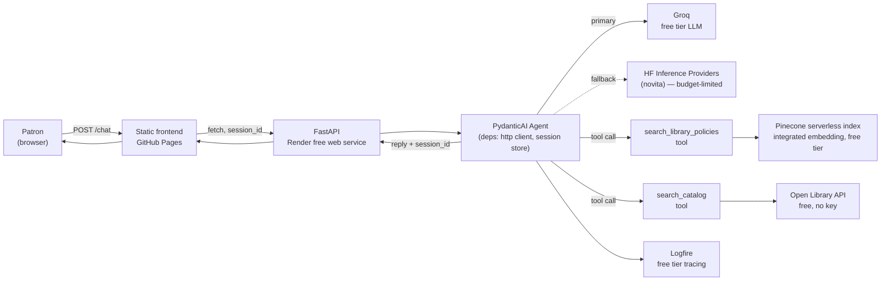
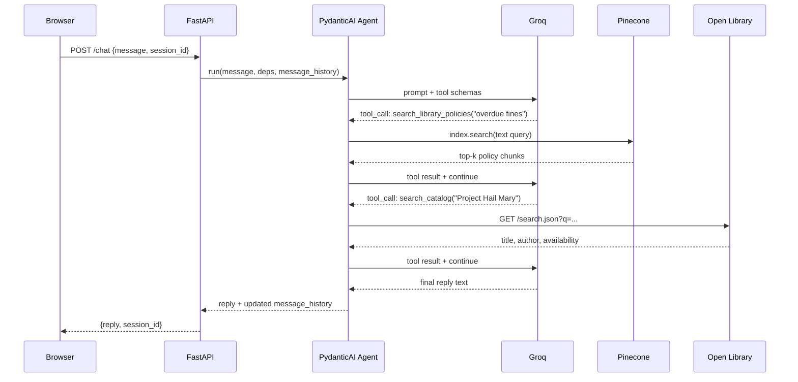

# LibSync Architecture

This is the as-built architecture after [Tier 1](TIER1_PLAN.md), including its optional Phase 5 polish:
real RAG, real catalog data, a budget-safe LLM provider, session continuity, tracing, streamed replies, and
structured book output — the foundation the rest of the [roadmap](README.md#-future-enhancements) builds
on. All of it runs at **$0/month** on free tiers; see
[TIER1_PLAN.md §4](TIER1_PLAN.md#4-budget-ledger-must-stay-at-0) for the budget ledger.

---

## System overview

## Request flow for a single turn

---

## Why these choices

**Groq as primary LLM, Hugging Face (novita) as fallback only.** Groq's free tier (30 RPM / 14,400
req/day, no card) is orders of magnitude safer than routing primary traffic through HF's paid `novita`
provider, which only grants $0.10/month in Inference Provider credit on a free account — enough for a
handful of requests before every call starts 402-ing. Both models are wrapped in a
[`FallbackModel`](https://ai.pydantic.dev/models/#fallback), so a Groq outage doesn't take the whole demo
down; it falls through to HF instead of failing the request outright. See
[`server/app/agent.py`](server/app/agent.py).

**Retry on leaked tool-call syntax, and `run_stream_events()` over `run_stream()` for streaming.** Verified
live against real Groq credentials, `llama-3.3-70b-versatile` sometimes puts a malformed tool call in the
text response itself (`<function=search_catalog{...}`, `<search_catalog>{...}</search_catalog>`, or raw
`{"type": "function", "name": "search_catalog", ...}` JSON) instead of issuing a real one — an
`output_validator` on `chat_agent` (see `_reject_leaked_tool_call_syntax` in
[`server/app/agent.py`](server/app/agent.py)) detects this and raises `ModelRetry`, and `retries=5` gives it
enough headroom to converge on a clean response. Separately, `stream_chat_reply` uses
`run_stream_events()`, not the more obvious `run_stream()`: `run_stream()` commits to the first content
matching `output_type`, so a model that narrates ("I'll check the catalog...") before its tool call would
have that narration accepted as the final answer and the tool call silently dropped — also verified live.
`run_stream_events()` wraps `run()` and runs the full graph, so the tool call after the narration still
executes.

**Open Library, not Libby/OverDrive/Kanopy/Hoopla, for real catalog data.** Those platforms have no public
developer API at any price for a hobby project — partnership-only. WorldCat needs an institutional key.
Open Library is free, keyless, and has genuinely library-shaped data: Search, Availability (borrow/lending
status via Internet Archive), and Covers APIs. The persona is explicit in its system prompt that concrete
book lookups are backed by Open Library, not a live connection to the commercial apps it also discusses —
this keeps the assistant from confidently inventing availability for platforms it has no data connection
to. See [`server/app/services/open_library_service.py`](server/app/services/open_library_service.py).

**Pinecone's integrated-embedding `search()`, not a precomputed-vector `query()`.** The index was
provisioned via `create_index_for_model` (see
[`pinecone-scripts/check_pinecone_index.py`](pinecone-scripts/check_pinecone_index.py)), which embeds
query text server-side. `search_library_policies` is a one-argument (`text: str`) PydanticAI tool as a
result — no separate embedding call, no dead "pass me a vector" contract. See
[`server/app/services/pinecone_service.py`](server/app/services/pinecone_service.py).

**An in-process session store, not a database.** Render's free instance has no durable disk and
sleeps/restarts on idle, so a $0-friendly design accepts that conversation history resets on cold start
rather than paying for a database. `SessionStore` (see
[`server/app/session_store.py`](server/app/session_store.py)) is a bounded, TTL-evicted
`dict[session_id, list[ModelMessage]]`. The session id is minted client-side
(`crypto.randomUUID()`, with a fallback for older environments), persisted in `localStorage`, and sent with
every request; the server mints one back if a caller doesn't provide one.

**Logfire, opt-in.** `logfire.instrument_pydantic_ai()` and `logfire.instrument_fastapi()` give real traces
of tool calls, retries, and token usage — replacing `print()` debugging — but only activate when
`LOGFIRE_TOKEN` is set (see [`server/app/main.py`](server/app/main.py)). Tests and CI never need a Logfire
account.

**A single frontend source, synced to `docs/`.** `client/src/` is the source of truth;
[`scripts/sync-docs.js`](scripts/sync-docs.js) copies it into `docs/` for GitHub Pages, and CI
(`.github/workflows/ci.yml`) fails the build if the two drift, which is what let them diverge in the first
place before this tier. The API base URL lives in one place, `client/src/config.js`, instead of being
hardcoded per copy.

**Streamed replies over SSE, plus structured book output.** `POST /chat/stream` opens the connection and
starts emitting `event: text` / `event: books` / `event: done` frames as soon as the agent has something to
say, rather than the frontend waiting on one large JSON response — this is what actually hides Render's
cold-start latency, since the browser sees activity immediately instead of a blank spinner. The agent's
`output_type` is `str | BookResult` (see [`server/app/schemas.py`](server/app/schemas.py)): PydanticAI lets
the model answer in plain text for everything, or call a structured "final answer" tool when it has
concrete `search_catalog` results, so the frontend renders real book cards from data
(`server/app/agent.py`'s `stream_chat_reply`) instead of regex-parsing prose. The plain `POST /chat`
endpoint (non-streaming, same structured-or-text reply shape) still exists for simpler clients and tests.

---

## Where things live

| Concern | Code |
|---|---|
| Agent, system prompt, tool registration | [`server/app/agent.py`](server/app/agent.py) |
| Shared deps injected into tools (`http_client`) | [`server/app/deps.py`](server/app/deps.py) |
| Conversation history store | [`server/app/session_store.py`](server/app/session_store.py) |
| Pinecone policy search | [`server/app/services/pinecone_service.py`](server/app/services/pinecone_service.py) |
| Open Library catalog search | [`server/app/services/open_library_service.py`](server/app/services/open_library_service.py) |
| `/chat` and `/chat/stream` endpoints | [`server/app/routers/chat.py`](server/app/routers/chat.py) |
| Structured output types (`Book`, `BookResult`) | [`server/app/schemas.py`](server/app/schemas.py) |
| `/api/query` endpoint (direct Pinecone search) | [`server/app/routers/pinecone_query.py`](server/app/routers/pinecone_query.py) |
| Frontend source | [`client/src/`](client/src/) |
| GitHub Pages copy (generated, do not hand-edit) | [`docs/`](docs/) |
| Pinecone IaC (index creation, seed data, smoke test) | [`pinecone-scripts/`](pinecone-scripts/) |

## What's next

[TIER2_PLAN.md](TIER2_PLAN.md) builds on this foundation directly: AG-UI streaming (a protocol-level
upgrade from the raw SSE here), interactive book/research/citation cards (extending the `BookResult` pattern
already live), and OpenAlex/Crossref tooling for a research-assistant mode. See the full
[roadmap](README.md#-future-enhancements) for Tiers 3–9.
