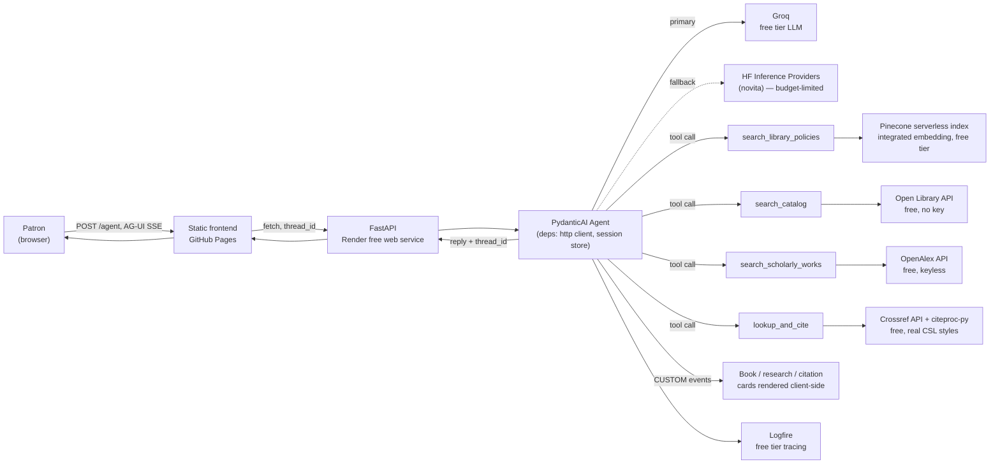
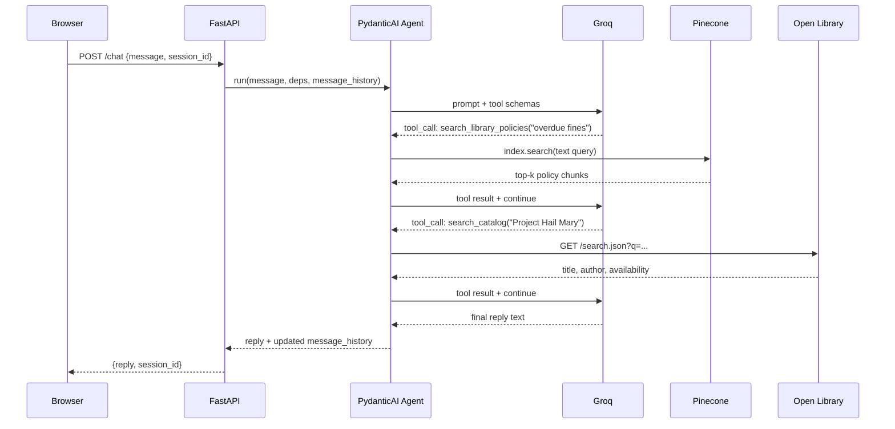
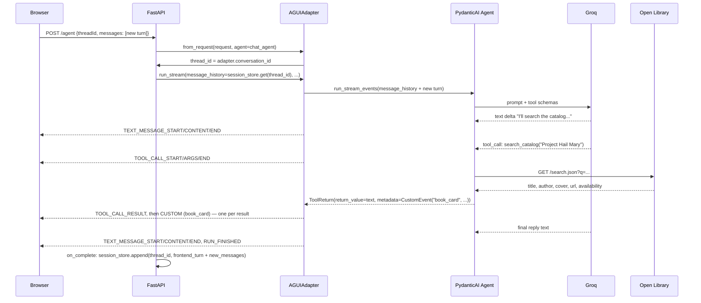

# LibSync Architecture

This is the as-built architecture after [Tier 1](TIER1_PLAN.md) and [Tier 2](TIER2_PLAN.md): real RAG, real
catalog/research/citation data, a budget-safe LLM provider, an interactive AG-UI transport, session
continuity, tracing, and structured card output — the foundation the rest of the
[roadmap](README.md#-future-enhancements) builds on. All of it runs at **$0/month** on free tiers; see
[TIER1_PLAN.md §4](TIER1_PLAN.md#4-budget-ledger-must-stay-at-0) and
[TIER2_PLAN.md §7](TIER2_PLAN.md#7-budget-ledger-addendum) for the budget ledgers. For a mechanical,
method-by-method trace of the backend — what runs at import time and a step-by-step walk of every request —
see [server/TRACE.md](server/TRACE.md); this doc stays at the "why" level.

---

## System overview

`/chat` and `/chat/stream` (the Tier 1 endpoints, plain JSON / bespoke SSE) still exist as a simpler
fallback transport — nothing was removed, `/agent` is additive. See
[TIER2_PLAN.md §6](TIER2_PLAN.md#6-phase-6--ag-ui-transport-migration) for why the migration was built this
way rather than as a breaking replacement.

## Request flow for a single turn (Tier 1 — `/chat`)

## Request flow for a single turn (Tier 2 — `/agent`, AG-UI)

The `on_complete` step matters more than it looks: `result.new_messages()` only covers what the run
generated *beyond* the `message_history` it was given, and `AGUIAdapter` folds the frontend's new turn into
that same `message_history` before running — so it never shows up in `new_messages()` on its own. Persisting
only `new_messages()` would silently drop the user's own message from history every turn, breaking
multi-turn continuity from the second turn onward. This was caught live (not by the unit tests) during
manual browser verification of Tier 2 — see [`server/app/routers/agent.py`](server/app/routers/agent.py)'s
`_persist` function and its comment for the fix.

---

## Why these choices

**Groq as primary LLM, Hugging Face (novita) as fallback only.** Groq's free tier (30 RPM / 14,400
req/day, no card) is orders of magnitude safer than routing primary traffic through HF's paid `novita`
provider, which only grants $0.10/month in Inference Provider credit on a free account — enough for a
handful of requests before every call starts 402-ing. Both models are wrapped in a
[`FallbackModel`](https://ai.pydantic.dev/models/#fallback), so a Groq outage doesn't take the whole demo
down; it falls through to HF instead of failing the request outright. See
[`server/app/agent.py`](server/app/agent.py).

**Retry on leaked tool-call syntax, and `run_stream_events()` over `run_stream()` for streaming.** Verified
live against real Groq credentials, `llama-3.3-70b-versatile` sometimes puts a malformed tool call in the
text response itself (`<function=search_catalog{...}`, `<search_catalog>{...}</search_catalog>`, or raw
`{"type": "function", "name": "search_catalog", ...}` JSON) instead of issuing a real one — an
`output_validator` on `chat_agent` (see `_reject_leaked_tool_call_syntax` in
[`server/app/agent.py`](server/app/agent.py)) detects this and raises `ModelRetry`, and `retries=5` gives it
enough headroom to converge on a clean response. Separately, `stream_chat_reply` uses
`run_stream_events()`, not the more obvious `run_stream()`: `run_stream()` commits to the first content
matching `output_type`, so a model that narrates ("I'll check the catalog...") before its tool call would
have that narration accepted as the final answer and the tool call silently dropped — also verified live.
`run_stream_events()` wraps `run()` and runs the full graph, so the tool call after the narration still
executes.

**Open Library, not Libby/OverDrive/Kanopy/Hoopla, for real catalog data.** Those platforms have no public
developer API at any price for a hobby project — partnership-only. WorldCat needs an institutional key.
Open Library is free, keyless, and has genuinely library-shaped data: Search, Availability (borrow/lending
status via Internet Archive), and Covers APIs. The persona is explicit in its system prompt that concrete
book lookups are backed by Open Library, not a live connection to the commercial apps it also discusses —
this keeps the assistant from confidently inventing availability for platforms it has no data connection
to. See [`server/app/services/open_library_service.py`](server/app/services/open_library_service.py).

**Pinecone's integrated-embedding `search()`, not a precomputed-vector `query()`.** The index was
provisioned via `create_index_for_model` (see
[`pinecone-scripts/check_pinecone_index.py`](pinecone-scripts/check_pinecone_index.py)), which embeds
query text server-side. `search_library_policies` is a one-argument (`text: str`) PydanticAI tool as a
result — no separate embedding call, no dead "pass me a vector" contract. See
[`server/app/services/pinecone_service.py`](server/app/services/pinecone_service.py).

**An in-process session store, not a database.** Render's free instance has no durable disk and
sleeps/restarts on idle, so a $0-friendly design accepts that conversation history resets on cold start
rather than paying for a database. `SessionStore` (see
[`server/app/session_store.py`](server/app/session_store.py)) is a bounded, TTL-evicted
`dict[session_id, list[ModelMessage]]`. The session id is minted client-side
(`crypto.randomUUID()`, with a fallback for older environments), persisted in `localStorage`, and sent with
every request; the server mints one back if a caller doesn't provide one.

**Logfire, opt-in.** `logfire.instrument_pydantic_ai()` and `logfire.instrument_fastapi()` give real traces
of tool calls, retries, and token usage — replacing `print()` debugging — but only activate when
`LOGFIRE_TOKEN` is set (see [`server/app/main.py`](server/app/main.py)). Tests and CI never need a Logfire
account.

**A single frontend source, published automatically instead of hand-synced.** `client/src/` is the source
of truth; [`scripts/build-site.js`](scripts/build-site.js) builds it (with an optional `API_BASE_URL`
override) into an output directory, and [`.github/workflows/deploy-pages.yml`](.github/workflows/deploy-pages.yml)
publishes that to the `gh-pages` branch on every push to `main` — no manual sync step, and no drift possible
between what's committed and what's live. This replaced an earlier Tier 1 design (`docs/` as a hand-committed
copy of `client/src/`, checked for drift by CI rather than published automatically) once PR previews needed
somewhere on the same Pages site to publish to that isn't the production root — see the next entry.

**PR previews via a hand-rolled workflow, not a third-party GitHub Action.** GitHub Pages has no native
per-PR preview mechanism — the standard pattern (used by actions like `rossjrw/pr-preview-action`) is
publishing each PR's build to a subpath (`pr-preview/pr-<number>/`) of a dedicated `gh-pages` branch, which
is why production also moved onto that branch rather than staying on `main`/`docs/` (Pages can only serve one
committed tree; subpaths need to coexist in it without a bot committing preview content directly onto the
protected trunk branch). [`.github/workflows/pr-preview.yml`](.github/workflows/pr-preview.yml) implements
this directly with `git`/`rsync`/`gh api` — clone the `gh-pages` branch, rsync the PR's build into its
subfolder, commit, push with a short retry-on-race loop (concurrent PR activity can conflict on a shared
branch), and use `gh api` to post or update a single tracked PR comment with the preview link, rather than
pulling in a marketplace dependency for something this mechanical.

**Only `deploy-pages.yml` is allowed to originate the `gh-pages` branch — `pr-preview.yml` never does.**
Caused a real (if brief) production outage the first time this pipeline actually ran: `deploy-pages.yml`
can only trigger on a push to `main`, and since these workflow files hadn't been merged there yet, it had
never run. When a PR opened, `pr-preview.yml`'s original fallback — "clone `gh-pages`, and if that fails,
`git init` a fresh one" — couldn't tell "the branch doesn't exist yet" apart from any other clone failure,
so it silently created `gh-pages` from scratch containing *only* `pr-preview/pr-<N>/`, no root content at
all. Pointing GitHub Pages at that branch's root then 404'd production — not because anything was deleted
(`main`'s `docs/` was untouched throughout), but because `gh-pages` had never actually been seeded with real
content in the first place. Fixed by checking existence explicitly with `git ls-remote --exit-code --heads`
before doing anything: `deploy-pages.yml` (the only workflow allowed to create the branch) re-checks this on
every retry attempt rather than once up front, since a concurrent run could create it mid-loop; `pr-preview.yml`
now hard-fails with a clear error instead of ever creating the branch itself. Hardened past just the one
specific failure mode with a direct invariant check in both workflows — `[ -f index.html ]` — rather than
only re-checking how it broke last time: `pr-preview.yml` refuses to publish a preview on top of a root
that's already broken (instead of silently succeeding while production stays 404), and `deploy-pages.yml`
refuses to commit a production publish that didn't produce a root `index.html` (catching a bad build or a
misconfigured `rsync --exclude` before it ever reaches production, not after).

**One shared dev backend for PR previews, not a per-PR ephemeral one.** Render's native "Preview
Environments" would give true per-PR backend isolation, but the preview URL is only known after Render
creates it (requiring a Render API key + lookup step to wire into the frontend preview), and whether a free
web service's previews are actually billed at $0 isn't explicitly confirmed in Render's docs — only that
"previews are billed at the same rate as the base service," stated alongside an explicit "free static site
previews are free" that doesn't extend the same explicit guarantee to compute services. Given how central
$0/month is to this whole project, a single extra free web service (`libsync-backend-dev`, auto-deploy
turned off, redeployed via its [deploy hook](https://render.com/docs/deploy-hooks)'s `ref` query param to
each PR's exact commit) is a known-$0 tradeoff for one real limitation: only the most-recently-pushed open
PR's code is actually live on it. The PR-preview workflow posts this caveat directly in its comment so it's
never a silent surprise mid-review.

**Streamed replies over SSE, plus structured book output (Tier 1 baseline).** `POST /chat/stream` opens the
connection and starts emitting `event: text` / `event: books` / `event: done` frames as soon as the agent
has something to say, rather than the frontend waiting on one large JSON response — this is what actually
hides Render's cold-start latency, since the browser sees activity immediately instead of a blank spinner.
The agent's `output_type` is `str | BookResult` (see [`server/app/schemas.py`](server/app/schemas.py)):
PydanticAI lets the model answer in plain text for everything, or call a structured "final answer" tool
when it has concrete `search_catalog` results, so the frontend renders real book cards from data
(`server/app/agent.py`'s `stream_chat_reply`) instead of regex-parsing prose. `/chat` (non-streaming, same
structured-or-text reply shape) still exists for simpler clients and tests, and both endpoints are
unchanged and still fully working after Tier 2 — `/agent` is additive, not a replacement.

**AG-UI protocol over extending the bespoke SSE protocol, for the interactive transport.** Two real specs
exist for agent-to-frontend interactivity: AG-UI (event-based streaming to a frontend you own) and MCP
Apps/MCP-UI (a generic MCP client rendering a third-party tool's UI in a sandboxed iframe). LibSync's
frontend is first-party and already trusted by its own backend — MCP Apps solves a problem LibSync doesn't
have. AG-UI has first-party PydanticAI support (`pydantic_ai.ui.ag_ui.AGUIAdapter`), so adopting it added
one dependency (`pydantic-ai-slim[ag-ui]`) rather than a new architecture. See
[TIER2_PLAN.md §2](TIER2_PLAN.md#2-what-interactive-ui-means-right-now-and-which-one-fits) for the full
comparison, and [TIER2_PLAN.md §5](TIER2_PLAN.md#5-roadmap-continues-tier-1s-phase-numbering) for the
phased rollout plan. The migration was deliberately additive (`/chat`/`/chat/stream` untouched) rather than
a breaking replacement, so a regression in the new transport can't take down the whole demo.

**`AGUIAdapter`'s composable pieces (`from_request` + `run_stream` + `streaming_response`), not the
all-in-one `dispatch_request` classmethod.** `dispatch_request` is the one-liner path, but it doesn't leave
a seam to inject `message_history` from `SessionStore` or persist new turns back to it afterward. The
composable path does — see
[`server/app/routers/agent.py`](server/app/routers/agent.py). The existing `SessionStore` needed no changes
at all: it's already just `dict[str, list[ModelMessage]]`, so switching its key from a bespoke `session_id`
to the AG-UI `thread_id` was a call-site change, not a data-model change.

**Cards ride on the existing tool-return mechanism, not a new one.** A tool returns
`pydantic_ai.messages.ToolReturn(return_value=..., metadata=<CustomEvent or a list of them>)`;
`AGUIEventStream` detects `BaseEvent` instances on `metadata` and yields them straight into the SSE stream.
This meant no new plumbing was needed to get a card in front of the frontend — `search_catalog`,
`search_scholarly_works`, and `lookup_and_cite` all reuse the same three-line `_custom_event()` helper in
[`server/app/agent.py`](server/app/agent.py). `metadata` accepting an *iterable* of events (not just one) is
what lets `search_catalog` emit one `book_card` event per result from a single tool call, rather than one
combined event the frontend has to unpack.

**Frontend text and cards must coexist as siblings, not overwrite each other.** The real event order for a
grounded answer is `TOOL_CALL_RESULT` → `CUSTOM` (the card) → `TEXT_MESSAGE_*` (the model's trailing
narration) — narration routinely arrives *after* the card, not before it. An earlier version of the
frontend's event handler unconditionally cleared the bubble's `innerHTML` on every `TEXT_MESSAGE_CONTENT`
event, which wiped out any card that had already rendered. This was caught live in a real browser (not by
the unit tests, which had mocked event orderings that happened not to exercise this case) — see
`ensureContentStarted()` in [`client/src/script.js`](client/src/script.js): the placeholder ("Thinking…"/
"Searching…") is cleared exactly once, on whichever event (text or card) arrives first, and everything
after that appends instead of replacing.

**OpenAlex for research, Crossref + citeproc-py for citations — both free and keyless, chosen for what they
add over Open Library alone.** OpenAlex is the actual "research help" data source: citation counts,
open-access flags, related/cited-by works — none of which Open Library has. Crossref gives real
bibliographic fields (author, year, container-title, DOI) by DOI or title search; citeproc-py then formats
them with the *actual* CSL 1.0.1 style files from `citeproc-py-styles` — the same processor family Zotero
uses — instead of asking the model to recall citation-formatting rules (et al. thresholds, page-range
dashes) from memory, which is wrong more often than it looks right. See
[TIER2_PLAN.md §1](TIER2_PLAN.md#1-whats-out-there-free-library--research-data-sources) for the full survey
of alternatives considered (Unpaywall, DPLA, Library of Congress) and why they're deferred to Tier 3/stretch
rather than built now.

**A short-lived Crossref cache exists specifically so the citation style switcher doesn't need a second
lookup.** `crossref_service.lookup_work` caches by DOI/title for a few minutes — the same TTL-cache pattern
`open_library_service` and `openalex_service` already used — so `GET /citation/{doi}?style=mla` (the style
switcher's endpoint) re-runs only the citeproc formatting step for a DOI already resolved this turn, instead
of hitting Crossref again for every style a patron clicks through.

**`fastapi<0.137`, pinned deliberately.** FastAPI 0.137 changed how `app.include_router()`-registered routes
are represented internally (a new `_IncludedRouter` type), which `opentelemetry-instrumentation-fastapi`
0.63b1 (the version `logfire[fastapi]>=4.37.0` currently resolves to) can't read `.path` off — every CORS
preflight `OPTIONS` request 500s whenever `LOGFIRE_TOKEN` is set, on *any* route, since every route in this
app is registered via `include_router()`. This is real enough to break the deployed demo for real browser
users (GitHub Pages and Render are different origins, so every chat message triggers a real preflight) — not
just a local annoyance. A fixed instrumentation release (`0.64b0`) exists, but it requires
`opentelemetry-semantic-conventions==0.64b0`, which conflicts with `logfire==4.37.0`'s own
`opentelemetry-sdk<1.43.0` ceiling — so pinning FastAPI below 0.137 was the only fix actually available
today. See the pin's comment in [`server/pyproject.toml`](server/pyproject.toml) for when it can be lifted.

---

## Where things live

| Concern | Code |
|---|---|
| Agent, system prompt, tool registration | [`server/app/agent.py`](server/app/agent.py) |
| Shared deps injected into tools (`http_client`) | [`server/app/deps.py`](server/app/deps.py) |
| Conversation history store, keyed by AG-UI thread id | [`server/app/session_store.py`](server/app/session_store.py) |
| Pinecone policy search | [`server/app/services/pinecone_service.py`](server/app/services/pinecone_service.py) |
| Open Library catalog search | [`server/app/services/open_library_service.py`](server/app/services/open_library_service.py) |
| OpenAlex scholarly-works search | [`server/app/services/openalex_service.py`](server/app/services/openalex_service.py) |
| Crossref bibliographic lookup (with short-lived cache) | [`server/app/services/crossref_service.py`](server/app/services/crossref_service.py) |
| Crossref → CSL-JSON mapping + citeproc-py formatting | [`server/app/services/citation_service.py`](server/app/services/citation_service.py) |
| `/agent` (AG-UI, primary transport) and `/citation/{doi}` (style switch) | [`server/app/routers/agent.py`](server/app/routers/agent.py) |
| `/chat` and `/chat/stream` endpoints (fallback transport) | [`server/app/routers/chat.py`](server/app/routers/chat.py) |
| Structured output types (`Book`, `BookResult`, `ScholarlyWork`, `ResearchResult`, `Citation`) | [`server/app/schemas.py`](server/app/schemas.py) |
| `/api/query` endpoint (direct Pinecone search) | [`server/app/routers/pinecone_query.py`](server/app/routers/pinecone_query.py) |
| Frontend source, incl. the AG-UI SSE event router | [`client/src/script.js`](client/src/script.js) |
| Frontend build (prod, and PR previews with an `API_BASE_URL` override) | [`scripts/build-site.js`](scripts/build-site.js) |
| Production Pages publish (`gh-pages` branch root, on push to `main`) | [`.github/workflows/deploy-pages.yml`](.github/workflows/deploy-pages.yml) |
| PR preview publish + shared dev backend redeploy + PR comment | [`.github/workflows/pr-preview.yml`](.github/workflows/pr-preview.yml) |
| Pinecone IaC (index creation, seed data, smoke test) | [`pinecone-scripts/`](pinecone-scripts/) |

## What's next

[TIER3_PLAN.md](TIER3_PLAN.md) builds on this foundation directly: surfacing Tier 2's tool calls and
grounded sources more visibly in the UI (capability chips, numbered source citations), a real card design
system, and an accessibility pass — in LibSync's existing black-and-amber brand, no new backend work. See
the full [roadmap](README.md#-future-enhancements) for Tiers 4–9.
