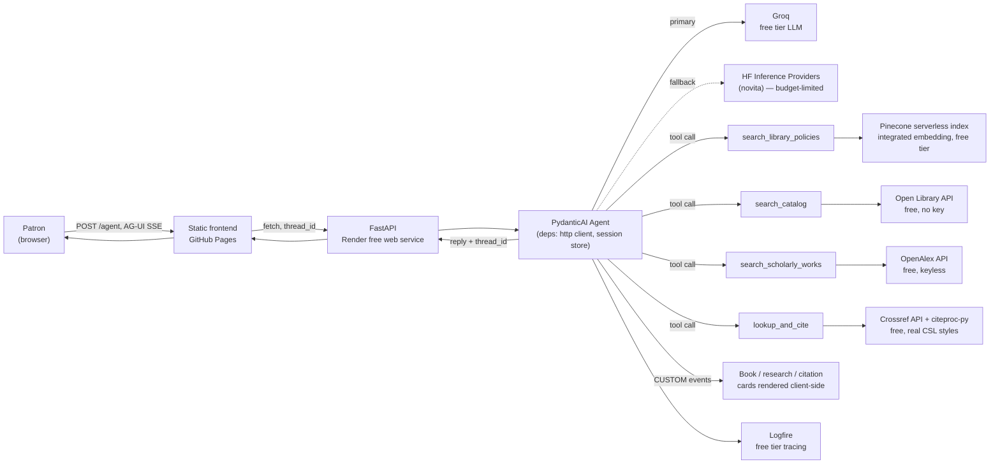
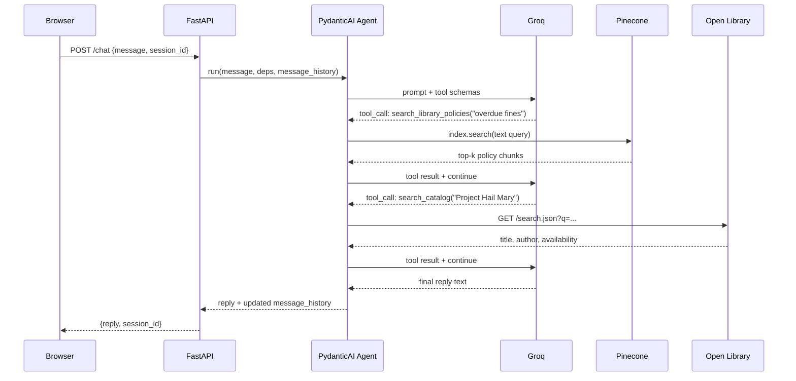
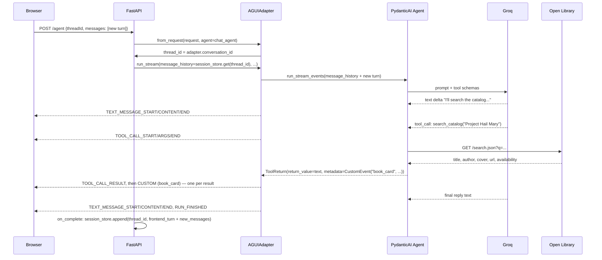

# LibSync Architecture

This is the as-built architecture after [Tier 1](TIER1_PLAN.md), [Tier 2](TIER2_PLAN.md), and
[Tier 3](TIER3_PLAN.md): real RAG, real catalog/research/citation data, a budget-safe LLM provider, an
interactive AG-UI transport, session continuity, tracing, structured card output, and a presentation layer
(safe markdown, accessibility, conversational affordances, grounding UI) on top of it — the foundation the
rest of the [roadmap](README.md#-future-enhancements) builds on. All of it runs at **$0/month** on free
tiers; see [TIER1_PLAN.md §4](TIER1_PLAN.md#4-budget-ledger-must-stay-at-0),
[TIER2_PLAN.md §7](TIER2_PLAN.md#7-budget-ledger-addendum), and
[TIER3_PLAN.md §7](TIER3_PLAN.md#7-budget-ledger-addendum) for the budget ledgers (Tier 3 added no new
services or dependencies — CSS and vanilla JS only). For a mechanical, method-by-method trace of the
backend — what runs at import time and a step-by-step walk of every request — see
[server/TRACE.md](server/TRACE.md); this doc stays at the "why" level.

---

## System overview

`/chat` and `/chat/stream` (the Tier 1 endpoints, plain JSON / bespoke SSE) still exist as a simpler
fallback transport — nothing was removed, `/agent` is additive. See
[TIER2_PLAN.md §6](TIER2_PLAN.md#6-phase-6--ag-ui-transport-migration) for why the migration was built this
way rather than as a breaking replacement.

## Request flow for a single turn (Tier 1 — `/chat`)

## Request flow for a single turn (Tier 2 — `/agent`, AG-UI)

The `on_complete` step matters more than it looks: `result.new_messages()` only covers what the run
generated *beyond* the `message_history` it was given, and `AGUIAdapter` folds the frontend's new turn into
that same `message_history` before running — so it never shows up in `new_messages()` on its own. Persisting
only `new_messages()` would silently drop the user's own message from history every turn, breaking
multi-turn continuity from the second turn onward. This was caught live (not by the unit tests) during
manual browser verification of Tier 2 — see [`server/app/routers/agent.py`](server/app/routers/agent.py)'s
`_persist` function and its comment for the fix.

---

## Why these choices

**Groq as primary LLM, Hugging Face (novita) as fallback only.** Groq's free tier (30 RPM / 14,400
req/day, no card) is orders of magnitude safer than routing primary traffic through HF's paid `novita`
provider, which only grants $0.10/month in Inference Provider credit on a free account — enough for a
handful of requests before every call starts 402-ing. Both models are wrapped in a
[`FallbackModel`](https://ai.pydantic.dev/models/#fallback), so a Groq outage doesn't take the whole demo
down; it falls through to HF instead of failing the request outright. See
[`server/app/agent.py`](server/app/agent.py).

**Retry on leaked tool-call syntax, and `run_stream_events()` over `run_stream()` for streaming.** Verified
live against real Groq credentials, `llama-3.3-70b-versatile` sometimes puts a malformed tool call in the
text response itself (`<function=search_catalog{...}`, `<search_catalog>{...}</search_catalog>`, or raw
`{"type": "function", "name": "search_catalog", ...}` JSON) instead of issuing a real one — an
`output_validator` on `chat_agent` (see `_reject_leaked_tool_call_syntax` in
[`server/app/agent.py`](server/app/agent.py)) detects this and raises `ModelRetry`, and `retries=5` gives it
enough headroom to converge on a clean response. Separately, `stream_chat_reply` uses
`run_stream_events()`, not the more obvious `run_stream()`: `run_stream()` commits to the first content
matching `output_type`, so a model that narrates ("I'll check the catalog...") before its tool call would
have that narration accepted as the final answer and the tool call silently dropped — also verified live.
`run_stream_events()` wraps `run()` and runs the full graph, so the tool call after the narration still
executes.

**Open Library, not Libby/OverDrive/Kanopy/Hoopla, for real catalog data.** Those platforms have no public
developer API at any price for a hobby project — partnership-only. WorldCat needs an institutional key.
Open Library is free, keyless, and has genuinely library-shaped data: Search, Availability (borrow/lending
status via Internet Archive), and Covers APIs. The persona is explicit in its system prompt that concrete
book lookups are backed by Open Library, not a live connection to the commercial apps it also discusses —
this keeps the assistant from confidently inventing availability for platforms it has no data connection
to. See [`server/app/services/open_library_service.py`](server/app/services/open_library_service.py).

**Pinecone's integrated-embedding `search()`, not a precomputed-vector `query()`.** The index was
provisioned via `create_index_for_model` (see
[`pinecone-scripts/check_pinecone_index.py`](pinecone-scripts/check_pinecone_index.py)), which embeds
query text server-side. `search_library_policies` is a one-argument (`text: str`) PydanticAI tool as a
result — no separate embedding call, no dead "pass me a vector" contract. See
[`server/app/services/pinecone_service.py`](server/app/services/pinecone_service.py).

**An in-process session store, not a database.** Render's free instance has no durable disk and
sleeps/restarts on idle, so a $0-friendly design accepts that conversation history resets on cold start
rather than paying for a database. `SessionStore` (see
[`server/app/session_store.py`](server/app/session_store.py)) is a bounded, TTL-evicted
`dict[session_id, list[ModelMessage]]`. The session id is minted client-side
(`crypto.randomUUID()`, with a fallback for older environments), persisted in `localStorage`, and sent with
every request; the server mints one back if a caller doesn't provide one.

**Logfire, opt-in.** `logfire.instrument_pydantic_ai()` and `logfire.instrument_fastapi()` give real traces
of tool calls, retries, and token usage — replacing `print()` debugging — but only activate when
`LOGFIRE_TOKEN` is set (see [`server/app/main.py`](server/app/main.py)). Tests and CI never need a Logfire
account.

**A single frontend source, built into `docs/`.** [`app/`](app/) (React + TypeScript, Vite) is the source of
truth as of [Tier 4](TIER4_PLAN.md); `npm run build` in `app/` emits straight into `docs/`
(`vite.config.ts`'s `outDir`), and CI (`.github/workflows/ci.yml`) fails the build if the two drift — the
same drift-prevention goal Tier 1's `sync-docs.js` copy-and-diff approach had, now enforced by an actual
build instead of a script someone has to remember to run. The API base URL lives in one place,
`app/src/config.ts` (`import.meta.env.VITE_API_BASE_URL`, falling back to the deployed Render URL), instead
of being hardcoded per copy.

**Streamed replies over SSE, plus structured book output (Tier 1 baseline).** `POST /chat/stream` opens the
connection and starts emitting `event: text` / `event: books` / `event: done` frames as soon as the agent
has something to say, rather than the frontend waiting on one large JSON response — this is what actually
hides Render's cold-start latency, since the browser sees activity immediately instead of a blank spinner.
The agent's `output_type` is `str | BookResult` (see [`server/app/schemas.py`](server/app/schemas.py)):
PydanticAI lets the model answer in plain text for everything, or call a structured "final answer" tool
when it has concrete `search_catalog` results, so the frontend renders real book cards from data
(`server/app/agent.py`'s `stream_chat_reply`) instead of regex-parsing prose. `/chat` (non-streaming, same
structured-or-text reply shape) still exists for simpler clients and tests, and both endpoints are
unchanged and still fully working after Tier 2 — `/agent` is additive, not a replacement.

**AG-UI protocol over extending the bespoke SSE protocol, for the interactive transport.** Two real specs
exist for agent-to-frontend interactivity: AG-UI (event-based streaming to a frontend you own) and MCP
Apps/MCP-UI (a generic MCP client rendering a third-party tool's UI in a sandboxed iframe). LibSync's
frontend is first-party and already trusted by its own backend — MCP Apps solves a problem LibSync doesn't
have. AG-UI has first-party PydanticAI support (`pydantic_ai.ui.ag_ui.AGUIAdapter`), so adopting it added
one dependency (`pydantic-ai-slim[ag-ui]`) rather than a new architecture. See
[TIER2_PLAN.md §2](TIER2_PLAN.md#2-what-interactive-ui-means-right-now-and-which-one-fits) for the full
comparison, and [TIER2_PLAN.md §5](TIER2_PLAN.md#5-roadmap-continues-tier-1s-phase-numbering) for the
phased rollout plan. The migration was deliberately additive (`/chat`/`/chat/stream` untouched) rather than
a breaking replacement, so a regression in the new transport can't take down the whole demo.

**`AGUIAdapter`'s composable pieces (`from_request` + `run_stream` + `streaming_response`), not the
all-in-one `dispatch_request` classmethod.** `dispatch_request` is the one-liner path, but it doesn't leave
a seam to inject `message_history` from `SessionStore` or persist new turns back to it afterward. The
composable path does — see
[`server/app/routers/agent.py`](server/app/routers/agent.py). The existing `SessionStore` needed no changes
at all: it's already just `dict[str, list[ModelMessage]]`, so switching its key from a bespoke `session_id`
to the AG-UI `thread_id` was a call-site change, not a data-model change.

**Cards ride on the existing tool-return mechanism, not a new one.** A tool returns
`pydantic_ai.messages.ToolReturn(return_value=..., metadata=<CustomEvent or a list of them>)`;
`AGUIEventStream` detects `BaseEvent` instances on `metadata` and yields them straight into the SSE stream.
This meant no new plumbing was needed to get a card in front of the frontend — `search_catalog`,
`search_scholarly_works`, and `lookup_and_cite` all reuse the same three-line `_custom_event()` helper in
[`server/app/agent.py`](server/app/agent.py). `metadata` accepting an *iterable* of events (not just one) is
what lets `search_catalog` emit one `book_card` event per result from a single tool call, rather than one
combined event the frontend has to unpack.

**Frontend text and cards must coexist as siblings, not overwrite each other.** The real event order for a
grounded answer is `TOOL_CALL_RESULT` → `CUSTOM` (the card) → `TEXT_MESSAGE_*` (the model's trailing
narration) — narration routinely arrives *after* the card, not before it. An earlier version of the
frontend's event handler unconditionally cleared the bubble's `innerHTML` on every `TEXT_MESSAGE_CONTENT`
event, which wiped out any card that had already rendered. This was caught live in a real browser (not by
the unit tests, which had mocked event orderings that happened not to exercise this case) — see
`ensureContentStarted()` in [`client/src/script.js`](client/src/script.js): the placeholder ("Thinking…"/
"Searching…") is cleared exactly once, on whichever event (text or card) arrives first, and everything
after that appends instead of replacing.

**OpenAlex for research, Crossref + citeproc-py for citations — both free and keyless, chosen for what they
add over Open Library alone.** OpenAlex is the actual "research help" data source: citation counts,
open-access flags, related/cited-by works — none of which Open Library has. Crossref gives real
bibliographic fields (author, year, container-title, DOI) by DOI or title search; citeproc-py then formats
them with the *actual* CSL 1.0.1 style files from `citeproc-py-styles` — the same processor family Zotero
uses — instead of asking the model to recall citation-formatting rules (et al. thresholds, page-range
dashes) from memory, which is wrong more often than it looks right. See
[TIER2_PLAN.md §1](TIER2_PLAN.md#1-whats-out-there-free-library--research-data-sources) for the full survey
of alternatives considered (Unpaywall, DPLA, Library of Congress) and why they're deferred to Tier 3/stretch
rather than built now.

**A short-lived Crossref cache exists specifically so the citation style switcher doesn't need a second
lookup.** `crossref_service.lookup_work` caches by DOI/title for a few minutes — the same TTL-cache pattern
`open_library_service` and `openalex_service` already used — so `GET /citation/{doi}?style=mla` (the style
switcher's endpoint) re-runs only the citeproc formatting step for a DOI already resolved this turn, instead
of hitting Crossref again for every style a patron clicks through.

**`fastapi<0.137`, pinned deliberately.** FastAPI 0.137 changed how `app.include_router()`-registered routes
are represented internally (a new `_IncludedRouter` type), which `opentelemetry-instrumentation-fastapi`
0.63b1 (the version `logfire[fastapi]>=4.37.0` currently resolves to) can't read `.path` off — every CORS
preflight `OPTIONS` request 500s whenever `LOGFIRE_TOKEN` is set, on *any* route, since every route in this
app is registered via `include_router()`. This is real enough to break the deployed demo for real browser
users (GitHub Pages and Render are different origins, so every chat message triggers a real preflight) — not
just a local annoyance. A fixed instrumentation release (`0.64b0`) exists, but it requires
`opentelemetry-semantic-conventions==0.64b0`, which conflicts with `logfire==4.37.0`'s own
`opentelemetry-sdk<1.43.0` ceiling — so pinning FastAPI below 0.137 was the only fix actually available
today. See the pin's comment in [`server/pyproject.toml`](server/pyproject.toml) for when it can be lifted.

**Tier 3's markdown renderer builds DOM nodes directly instead of ever touching `innerHTML` with interpolated
text.** Model output is untrusted — it can echo retrieved text or be steered via prompt injection — so
`renderInlineMarkdown` (see [`client/src/script.js`](client/src/script.js)) matches a small, fixed set of
patterns (`**bold**`, `*italic*`, `[text](https://url)`) and inserts everything else, matched or not, as a
plain text node via `document.createTextNode`/`el.textContent`. There is no code path where a string derived
from the model can become live markup — closing the gap the [TIER3_PLAN.md §1](TIER3_PLAN.md#1-brand-audit--whats-actually-there-today)
audit flagged, while finally rendering the bold/link formatting the model already tends to produce.

**"Grounded in N sources" and numbered card badges are computed client-side from the cards already
rendered, not from new backend-supplied citation markers.** Tier 3's definition of done requires no backend
changes, and the model doesn't emit inline `[1]`-style markers into its own text. Instead, every `book_card`,
`research_results` work, and `citation` CUSTOM event rendered into a reply increments a per-turn counter
(`ctx.cardCount` in `consumeAgentStream`); each card gets a numbered `.source-badge` in render order, and a
`.grounded-tag` summarizing the count is prepended once the turn finishes. This gives Tier 2's retrieval work
a visible, honest payoff (a reply either shows sources or it doesn't) without inventing a citation-marker
protocol the backend doesn't produce.

**Regenerate and retry re-run the question through a shared `runAgentTurn`, not a second copy of
`sendMessage`'s body.** `sendMessage` appends the user bubble then delegates to `runAgentTurn(question)`;
`regenerateLastReply()` calls the same function with the last question and no new user bubble. The error
bubble's Retry button and a completed reply's Regenerate action both remove their message element and call
`regenerateLastReply()` — so neither path duplicates the user's turn in the transcript, and stopping
mid-stream (via `AbortController`, wired through `fetch`'s `signal`) reuses the exact same finalization path
(`finalizeCompletedTurn`) as a normal completion, just with a "(Stopped)" note instead of a fallback message.

---

## Where things live

| Concern | Code |
|---|---|
| Agent, system prompt, tool registration | [`server/app/agent.py`](server/app/agent.py) |
| Shared deps injected into tools (`http_client`) | [`server/app/deps.py`](server/app/deps.py) |
| Conversation history store, keyed by AG-UI thread id | [`server/app/session_store.py`](server/app/session_store.py) |
| Pinecone policy search | [`server/app/services/pinecone_service.py`](server/app/services/pinecone_service.py) |
| Open Library catalog search | [`server/app/services/open_library_service.py`](server/app/services/open_library_service.py) |
| OpenAlex scholarly-works search | [`server/app/services/openalex_service.py`](server/app/services/openalex_service.py) |
| Crossref bibliographic lookup (with short-lived cache) | [`server/app/services/crossref_service.py`](server/app/services/crossref_service.py) |
| Crossref → CSL-JSON mapping + citeproc-py formatting | [`server/app/services/citation_service.py`](server/app/services/citation_service.py) |
| `/agent` (AG-UI, primary transport) and `/citation/{doi}` (style switch) | [`server/app/routers/agent.py`](server/app/routers/agent.py) |
| `/chat` and `/chat/stream` endpoints (fallback transport) | [`server/app/routers/chat.py`](server/app/routers/chat.py) |
| Structured output types (`Book`, `BookResult`, `ScholarlyWork`, `ResearchResult`, `Citation`) | [`server/app/schemas.py`](server/app/schemas.py) |
| `/api/query` endpoint (direct Pinecone search) | [`server/app/routers/pinecone_query.py`](server/app/routers/pinecone_query.py) |
| AG-UI transport hook (`HttpAgent`-backed streaming/retry/abort) | [`app/src/hooks/useAgentStream.ts`](app/src/hooks/useAgentStream.ts) |
| Safe markdown renderer (real React elements, never `dangerouslySetInnerHTML`) | [`app/src/lib/markdown.tsx`](app/src/lib/markdown.tsx) |
| Chat UI components (bubbles, cards, chips, tool-status pills, message actions) | [`app/src/components/`](app/src/components/) |
| Design tokens (`--ls-*` custom properties) and component styles | [`app/src/theme/`](app/src/theme/) |
| GitHub Pages source (generated by `npm run build` in `app/`, do not hand-edit) | [`docs/`](docs/) |
| Pinecone IaC (index creation, seed data, smoke test) | [`pinecone-scripts/`](pinecone-scripts/) |

## What's next

Tier 3 shipped a safe (escape-by-default) markdown renderer closing the raw-`innerHTML` XSS gap, an
accessibility baseline (`role="log"`/`aria-live` on the chat region, visible focus rings, `prefers-reduced-motion`
handling), suggestion chips and per-tool status pills, a stop/regenerate/copy action set, a scroll-to-latest
control, numbered source badges with a "Grounded in N sources" tag, and a distinct error style with an
inline Retry — all CSS and vanilla JS on the existing black-and-amber brand, no backend changes. See
[TIER3_PLAN.md](TIER3_PLAN.md) for the full plan and rationale.

Tier 4 is built: that component/token spec, ported 1:1 into a React + TypeScript codebase on Vite
(`app/`), with `docs/` now a build artifact instead of a hand-copied source tree — behavior-preserving, no
visual redesign, no backend changes. It deviates from [TIER4_PLAN.md](TIER4_PLAN.md) §2.2 in one way: it
uses `@ag-ui/client`'s `HttpAgent` directly rather than `@copilotkit/react-core`/`react-ui`, since
CopilotKit's React hooks are built around a Node Copilot Runtime proxy that isn't officially supported to
bypass, and standing one up just to relay to this repo's existing Python AG-UI endpoint would have added
infrastructure Tier 4 was explicit about not needing. `@ag-ui/client` is still the same team's official,
protocol-level SDK — it's what PydanticAI's own AG-UI reference frontend uses. See
[TIER4_PLAN.md](TIER4_PLAN.md) for the full plan; see the full [roadmap](README.md#-future-enhancements) for
Tiers 5–9.
