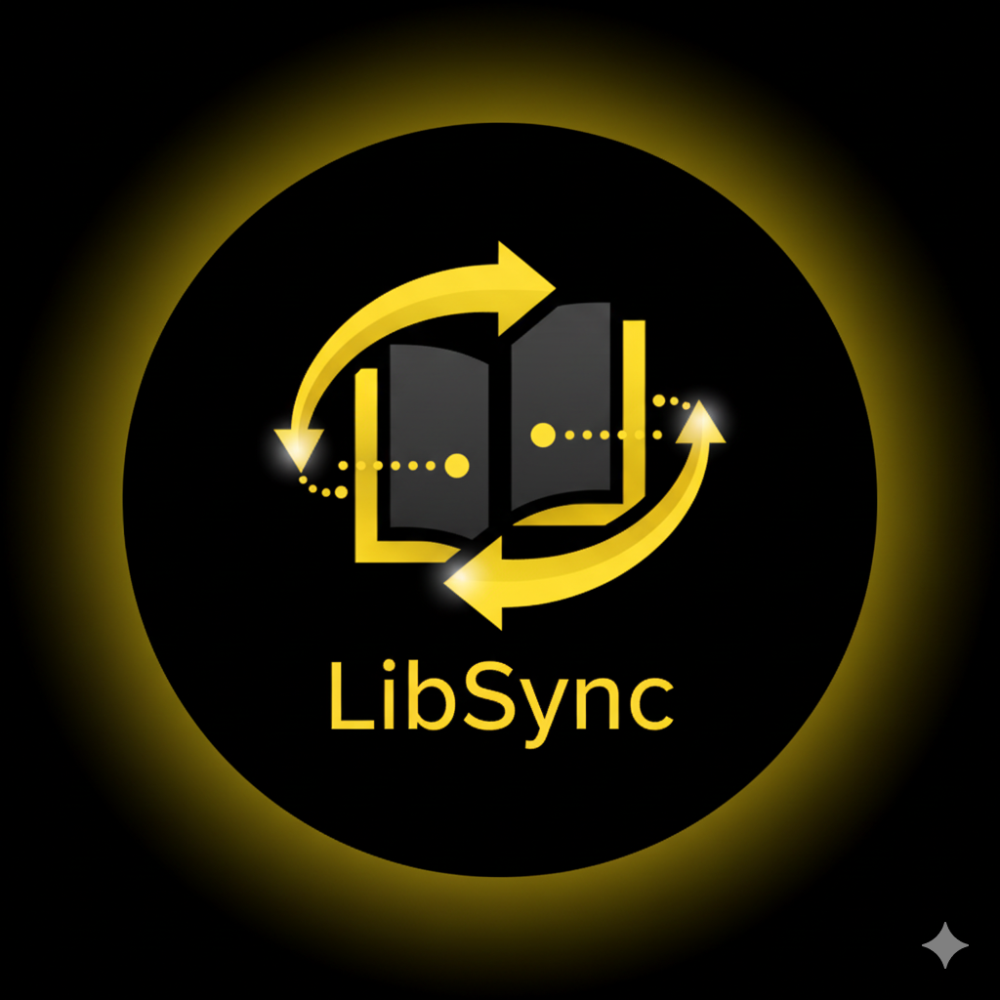
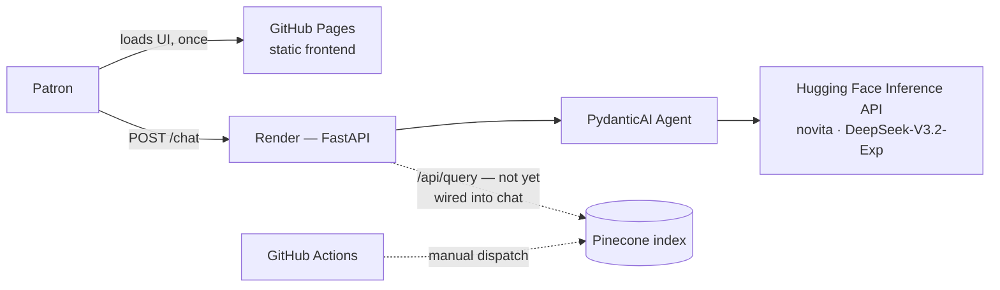
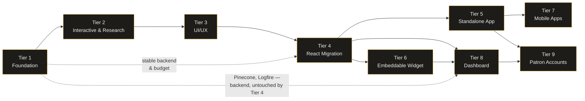

<p align="center">
  
</p>

<h1 align="center">LibSync</h1>
<p align="center"><i>Your personal AI library assistant — a full-stack PydanticAI portfolio demo.</i></p>

<p align="center">
  
  
  
  
  
  
  
</p>

<p align="center">
  <a href="https://johnniemaeb.github.io/LibSync/"><b>Live Demo</b></a> ·
  <a href="#-target-experience">Where It's Headed</a> ·
  <a href="#-local-setup">Local Setup</a> ·
  <a href="#-future-enhancements">Roadmap</a>
</p>

**LibSync** is an AI-powered chatbot designed to assist users with library services. Built with a Python/PydanticAI backend and a vanilla JS frontend, LibSync demonstrates a full-stack workflow, cloud deployment, and AI integration.

---

## Contents

- [Purpose](#-purpose)
- [Tech Stack](#-tech-stack)
- [Architecture Overview](#-architecture-overview)
- [Target Experience](#-target-experience)
- [Skills Demonstrated](#-skills-demonstrated)
- [Features](#-features)
- [Local Setup](#-local-setup)
- [Project Structure](#-project-structure)
- [Cloud Deployment](#-cloud-deployment-render)
- [Future Enhancements](#-future-enhancements)
- [Featured Deployment](#-featured-deployment)

---

## 🎯 Purpose

LibSync provides a conversational interface for library patrons, enabling natural language questions and helpful responses.
The project is currently in **active development**, focusing on technical experimentation, deployment workflows, and AI capabilities.

---

## 🛠️ Tech Stack

- **Frontend:** Vanilla JavaScript, HTML, CSS
- **Backend:** Python, FastAPI
- **AI Integration:** [PydanticAI](https://ai.pydantic.dev/) agent calling the Hugging Face Inference API (novita provider, `deepseek-ai/DeepSeek-V3.2-Exp`)
- **Vector Database:** Pinecone (for semantic search and retrieval)
- **Package Management:** [uv](https://docs.astral.sh/uv/) for the Python backend and IaC scripts
- **Automation & DevOps:** GitHub Actions for CI/CD and Infrastructure as Code (IaC)
- **Cloud Deployment:** Render

---

## 🧩 Architecture Overview

- **Frontend:** Simple chat UI built with JavaScript, HTML, and CSS (`client/src`, mirrored to `docs/` for GitHub Pages)
- **Backend:** FastAPI server (`server/`) handling requests, rate limiting, and a PydanticAI agent that calls Hugging Face models
- **Vector Layer:** Pinecone stores library policy content; retrieval isn't wired into the chat agent yet — see [TIER1_PLAN.md](TIER1_PLAN.md)
- **Automation:** GitHub Actions workflow provisions and updates Pinecone vectors (IaC), via Python scripts in `pinecone-scripts/`
- **Deployment:** Hosted on Render (backend) and GitHub Pages (frontend)



This is today's actual wiring, not the target — the tiered plans linked under
[Future Enhancements](#-future-enhancements) close the gap between this and a fully-grounded assistant.

---

## 🎨 Target Experience

LibSync's live demo today is a straightforward chat widget. The mockup below is the **design target** from the
[Tier 3 UI/UX plan](TIER3_PLAN.md) — capability chips, live tool-call status, card-based book and citation
results, and grounded replies with numbered source citations — built entirely in LibSync's existing
black-and-amber brand.

<p align="center">
  
</p>

<p align="center"><sub>Static mockup — see <a href="#-future-enhancements">Future Enhancements</a> for the plan that builds it.</sub></p>

Patrons are only half the picture. [Tier 8](TIER8_PLAN.md) gives library staff a real dashboard — free-tier
budget headroom surfaced where they'll actually see it, not buried in a planning doc:

<p align="center">
  
</p>

<p align="center"><sub>Also mocked up: <a href="TIER8_PLAN.md">document upload and the Koha catalog "hookup"</a>, and <a href="TIER9_PLAN.md">patron sign-in with a real library card</a>.</sub></p>

---

## 🏆 Skills Demonstrated

- **Full-Stack Development:** Building and connecting frontend (JS/HTML/CSS) with backend (Python/FastAPI)
- **Agentic AI Integration:** Using PydanticAI to define a typed, testable agent around the Hugging Face Inference API
- **Vector Search & Retrieval:** Implementing Pinecone for RAG workflows and policy-based query retrieval
- **Infrastructure as Code (IaC):** Automating Pinecone vector DB setup and data upserts with GitHub Actions
- **Cloud Deployment:** Deploying backend on Render, frontend on GitHub Pages
- **Environment Configuration & Security:** Managing environment variables and securing API tokens
- **Debugging & Logging:** Implementing request/response logging for monitoring and troubleshooting
- **Project Workflow:** Version control with Git, branching, and automated build/test pipelines
- **UI/UX Design:** Real-time chat interface, responsive and interactive frontend design
- **Technical Roadmapping:** A nine-tier, dependency-mapped growth plan from prototype to multi-tenant SaaS — each tier budget-audited, cross-referenced, and mocked up before a line of new code, not just described

---

## ✨ Features

- Real-time chat interface
- PydanticAI-powered responses via Hugging Face
- Cloud deployment for remote access

---

## 💻 Local Setup

### Prerequisites

- **uv** (Python package/project manager — installs its own Python if needed). If `uv` isn't already on your machine:

  ```powershell
  # Windows (PowerShell)
  powershell -ExecutionPolicy Bypass -c "irm https://astral.sh/uv/install.ps1 | iex"
  ```

  ```bash
  # macOS / Linux
  curl -LsSf https://astral.sh/uv/install.sh | sh
  ```

  The installer prints where it placed `uv.exe` (typically `C:\Users\<you>\.local\bin` on Windows or `~/.local/bin` on macOS/Linux). **Close and reopen your terminal** (or open a new PowerShell/shell window) after installing — the installer updates your PATH, but only takes effect in new terminal sessions. Verify it worked with:

  ```
  uv --version
  ```

  <details>
  <summary><code>uv</code> still not recognized after reopening a terminal?</summary>

  On Windows, a new _tab_ or _window_ in Windows Terminal / VS Code doesn't always pick up a PATH change — the
  terminal _application_ itself needs to fully restart, since it re-reads the environment only when its own
  process starts. Try, in order:
  1. Fully quit the terminal app (not just the tab/window — e.g. quit Windows Terminal from the taskbar, or fully close and reopen VS Code), then relaunch it.
  2. If that still fails, log off and back on to Windows (or restart), which refreshes the environment for all new processes.
  3. To unblock yourself immediately without restarting anything, add it to just the current session:
     ```powershell
     $env:Path += ";$env:USERPROFILE\.local\bin"
     ```

  See the [official install docs](https://docs.astral.sh/uv/getting-started/installation/) for other options (e.g. `pip install uv`, Homebrew, winget).
  </details>

- Node.js (only for running the static frontend's dev tooling/tests, if desired)

### 1. Clone the repository

```bash
git clone <your-repo-url>
cd LibSync
```

### 2. Configure the backend

Create a `.env` file inside `server/` (see `server/.env.example`):

```
HUGGINGFACE_TOKEN=your_huggingface_api_token_here
PINECONE_API_KEY=your_pinecone_api_key_here
PORT=3000
```

**Getting a Hugging Face token:** the Inference Providers API (used here to call `deepseek-ai/DeepSeek-V3.2-Exp` via novita) requires a token even on the free tier, since usage is tracked against your HF account.

1. Create a free account at [huggingface.co/join](https://huggingface.co/join).
2. Go to [huggingface.co/settings/tokens](https://huggingface.co/settings/tokens) and click **New token**.
3. A **Read** token is sufficient for inference calls — no billing setup required for free-tier model usage.
4. Copy the generated token into `HUGGINGFACE_TOKEN` in your `.env` file.

### 3. Install backend dependencies and run the server

`uv` reads `server/pyproject.toml`, creates an isolated virtual environment, and installs everything automatically — no manual `pip install` or `venv` activation required.

```bash
cd server
uv sync
uv run uvicorn app.main:app --reload --port 3000
```

The API is now running at `http://localhost:3000`, with interactive docs at `http://localhost:3000/docs`.

### 4. Run the backend tests

```bash
cd server
uv run pytest
```

### 5. Run the frontend locally

Open `client/src/index.html` in your browser. By default it points at the deployed Render backend — to test against your local server, update the `fetch` URL in `client/src/script.js`:

```JavaScript
const response = await fetch("http://localhost:3000/chat", { ... });
```

### 6. Start chatting! 💬

---

## 🗂️ Project Structure

```
LibSync/
├── client/src/          # Static frontend (vanilla JS/HTML/CSS)
├── docs/                # GitHub Pages mirror of client/src
├── server/              # Python/FastAPI + PydanticAI backend (uv-managed)
│   ├── app/
│   │   ├── main.py          # FastAPI app, CORS, rate limiting, routers
│   │   ├── agent.py         # PydanticAI agent + system prompt
│   │   ├── bot_context/     # Persona and library-policy knowledge sources
│   │   ├── routers/         # /chat and /api/query endpoints
│   │   └── services/        # Pinecone client wrapper
│   ├── tests/            # pytest suite
│   └── pyproject.toml
├── pinecone-scripts/     # Python IaC scripts (uv-managed) for the Pinecone index
└── planning/             # Tier 1-9 roadmap: durable source for Future Enhancements below
    ├── TIER1_PLAN.html … TIER9_PLAN.html   # self-contained visual companions to the .md docs
    └── assets/           # mockups and charts embedded in the plans and this README
```

---

## ☁️ Cloud Deployment (Render)

- **Runtime/Environment:** Python 3
- **Root Directory:** `server`
- **Build Command:** `pip install uv && uv sync --frozen`
- **Start Command:** `uv run uvicorn app.main:app --host 0.0.0.0 --port $PORT`
- **Environment Variables:** Set `HUGGINGFACE_TOKEN` and `PINECONE_API_KEY` on Render

> **Migrating an existing Render service from before this refactor?** The service was originally configured for the Node backend at `server/src` and won't update itself just because the code changed — Render settings are dashboard state, not something a `git push` touches. In the Render dashboard, open the service → **Settings** → **Build & Deploy** and update all four fields above (Runtime, Root Directory, Build Command, Start Command) to match this table, then trigger a manual deploy. If your plan doesn't let you change **Runtime** on an existing service, create a new Python web service pointed at this repo instead and delete the old Node one.

Once deployed, update the frontend `fetch` URL to point to your Render URL:

```JavaScript
const response = await fetch("https://<your-render-app>.onrender.com/chat", {
  method: "POST",
  headers: {
    "Content-Type": "application/json",
  },
  body: JSON.stringify({ message: question }),
});
```

---

## 🛠️ Future Enhancements

Planning for everything below lives in nine tiered documents rather than this section, so the detail stays
up to date without bloating the README. Each is a standalone Markdown doc with an accompanying visual plan —
the visual plans are self-contained HTML (no build step, no external requests) checked into
[`planning/`](planning/); download and open one locally, or view the live-rendered version.

The tiers aren't a straight line. Tier 8's dashboard reaches back to Tier 1 directly for Pinecone and Logfire —
pieces Tier 4's *frontend* migration never touched — rather than inheriting them through the whole Tier 2/3/4
chain:



And the tiers are not remotely equal in size — Tier 8's real multi-tenancy work is nearly triple Tier 6's
embeddable widget:

<p align="center">
  
</p>

| Tier | Focus | Doc | Visual plan (local) | Visual plan (rendered) |
|---|---|---|---|---|
| 1 | Foundation — real RAG, real catalog data (Open Library), a $0-safe LLM provider (Groq), session continuity, observability | [TIER1_PLAN.md](TIER1_PLAN.md) | [planning/TIER1_PLAN.html](planning/TIER1_PLAN.html) | [rendered](https://claude.ai/code/artifact/6d36123a-b07b-471b-b792-fa2f72f70222) |
| 2 | Interactive & research — AG-UI streaming, interactive book/research/citation cards, OpenAlex + Crossref/citeproc tooling | [TIER2_PLAN.md](TIER2_PLAN.md) | [planning/TIER2_PLAN.html](planning/TIER2_PLAN.html) | [rendered](https://claude.ai/code/artifact/6a4601ca-c629-478a-818f-fc6134221838) |
| 3 | UI/UX — grounded-citation UI, accessibility pass, a real design-token system on top of the current brand | [TIER3_PLAN.md](TIER3_PLAN.md) | [planning/TIER3_PLAN.html](planning/TIER3_PLAN.html) | [rendered](https://claude.ai/code/artifact/e444be53-8ca6-4813-8e07-2c6c92653448) |
| 4 | React migration — behavior-preserving move to React + CopilotKit/AG-UI, the shared component library Tiers 5–9 build on | [TIER4_PLAN.md](TIER4_PLAN.md) | [planning/TIER4_PLAN.html](planning/TIER4_PLAN.html) | [rendered](https://claude.ai/code/artifact/18dd2d0c-9a27-4000-94c1-b49b05a87632) |
| 5 | Standalone web app — dynamic responsive layout, PWA installability, and **multi-conversation chat history** | [TIER5_PLAN.md](TIER5_PLAN.md) | [planning/TIER5_PLAN.html](planning/TIER5_PLAN.html) | [rendered](https://claude.ai/code/artifact/501ca3cc-b4c9-4f9a-a233-54a43134eb5a) |
| 6 | Embeddable widget — a two-line snippet for library websites, iframe-isolated, reusing the Tier 4 components | [TIER6_PLAN.md](TIER6_PLAN.md) | [planning/TIER6_PLAN.html](planning/TIER6_PLAN.html) | [rendered](https://claude.ai/code/artifact/bdb8c64e-4019-4c39-bf6f-7d05538e3b30) |
| 7 | Mobile apps — Capacitor wraps the Tier 5 app for iOS/Android; $0-complete via sideload, store publication marked as an explicit paid exception | [TIER7_PLAN.md](TIER7_PLAN.md) | [planning/TIER7_PLAN.html](planning/TIER7_PLAN.html) | [rendered](https://claude.ai/code/artifact/807f868c-4dda-4507-8960-84c4c93ea233) |
| 8 | Developer/manager/statistics dashboard — real multi-tenancy (Supabase + Pinecone namespaces), Koha catalog integration, Logfire-powered usage stats, for library staff — **with dashboard/connector mockups** | [TIER8_PLAN.md](TIER8_PLAN.md) | [planning/TIER8_PLAN.html](planning/TIER8_PLAN.html) | [rendered](https://claude.ai/code/artifact/79654d95-bdfa-44df-af27-c9a46e41fc1b) |
| 9 | Patron accounts — dual-mode auth (real library card via Tier 8's catalog connector, or email fallback), optional and additive, never a wall in front of the chat | [TIER9_PLAN.md](TIER9_PLAN.md) | [planning/TIER9_PLAN.html](planning/TIER9_PLAN.html) | [rendered](https://claude.ai/code/artifact/e760505b-d41b-4f04-94e4-d8d7c413131b) |

GitHub's file viewer shows these as raw source rather than rendering them — the "rendered" links are the
easiest way to view them in-browser; the local copies are the durable, versioned source.

All nine hold to the same constraint as the rest of this project: **$0/month** — with two explicit,
clearly-marked exceptions: Tier 7 (native app store publication costs real money; sideloading and PWA install
don't) and Tier 8 at scale (Supabase's free-tier ceilings are a "watch this, same as Pinecone/Render" item, not
a hard cost, but real at enough tenants).

---

## 🚀 Featured Deployment

Experience LibSync in action! Interact with the chatbot and explore the UI:

| Environment | Link                                                       |
| ----------- | ---------------------------------------------------------- |
| Prod        | [🌐 Visit LibSync](https://johnniemaeb.github.io/LibSync/) |

Interact with the chatbot, explore the interface, and see the project in action.

> **Note:** This is a demo project running exclusively on free-tier services. The backend on Render may spin down after periods of inactivity, which can result in a delay of up to ~50 seconds for the AI to respond when waking from idle.
