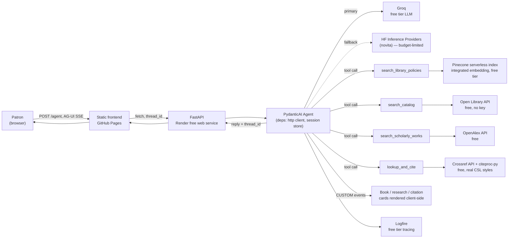
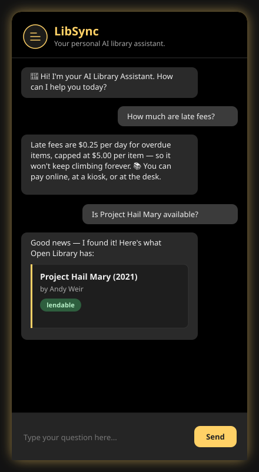
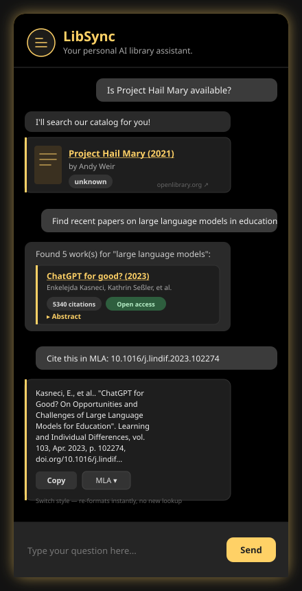
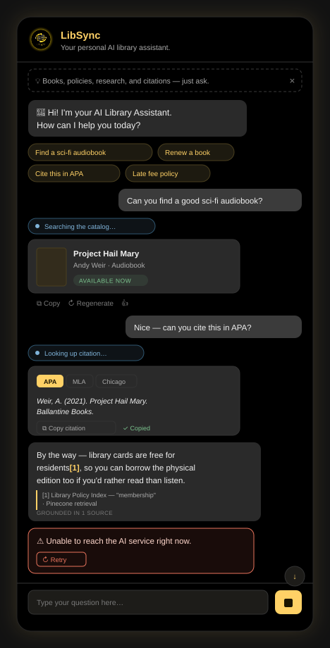
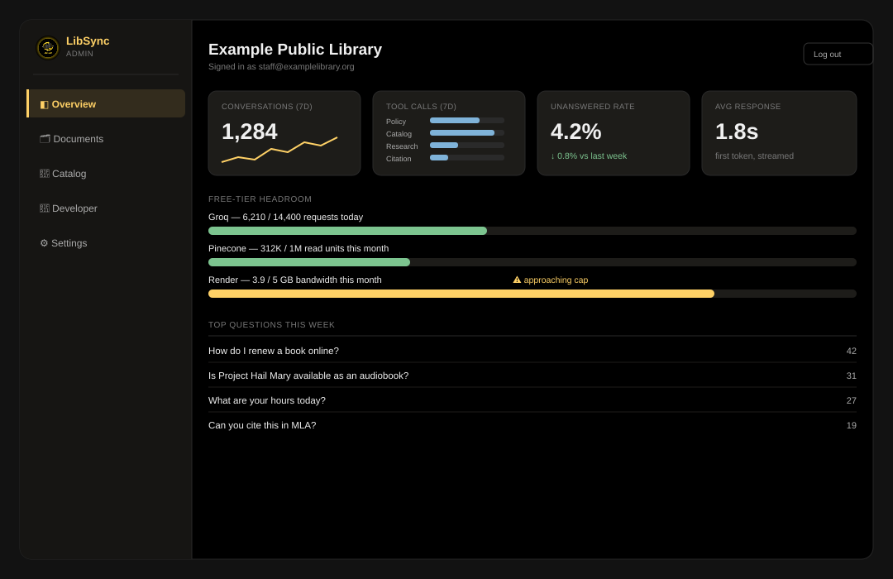
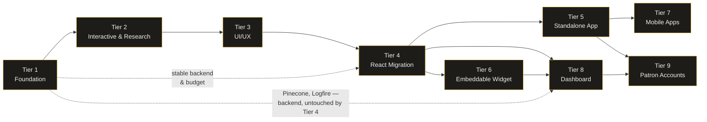
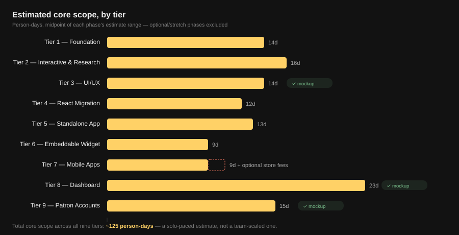

<p align="center">
  
</p>

<h1 align="center">LibSync</h1>
<p align="center"><i>Your personal AI library assistant — a full-stack PydanticAI portfolio demo.</i></p>

<p align="center">
  
  
  
  
  
  
  
</p>

<p align="center">
  <a href="https://johnniemaeb.github.io/LibSync/"><b>Live Demo</b></a> ·
  <a href="#-target-experience">Where It's Headed</a> ·
  <a href="#-local-setup">Local Setup</a> ·
  <a href="#-future-enhancements">Roadmap</a>
</p>

**LibSync** is an AI-powered chatbot designed to assist users with library services. Built with a Python/PydanticAI backend and a React/Vite frontend, LibSync demonstrates a full-stack workflow, cloud deployment, and AI integration.

---

## Contents

- [Purpose](#-purpose)
- [Tech Stack](#-tech-stack)
- [Architecture Overview](#-architecture-overview)
- [Target Experience](#-target-experience)
- [Skills Demonstrated](#-skills-demonstrated)
- [Features](#-features)
- [Local Setup](#-local-setup)
- [Demo Script](DEMO_SCRIPT.md)
- [Project Structure](#-project-structure)
- [Cloud Deployment](#-cloud-deployment-render)
- [PR Previews and Deployment](#-pr-previews-and-deployment)
- [Future Enhancements](#-future-enhancements)
- [Featured Deployment](#-featured-deployment)

For the full request-flow diagrams and the reasoning behind each infrastructure choice, see
[ARCHITECTURE.md](ARCHITECTURE.md); for a mechanical, method-by-method trace of the backend (entry point
through every file and function), see [server/TRACE.md](server/TRACE.md). Contributing? See
[CONTRIBUTING.md](CONTRIBUTING.md).

---

## 🎯 Purpose

LibSync provides a conversational interface for library patrons, enabling natural language questions and helpful responses.
The project is currently in **active development**, focusing on technical experimentation, deployment workflows, and AI capabilities.

---

## 🛠️ Tech Stack

- **Frontend:** React + TypeScript on Vite, talking AG-UI directly via `@ag-ui/client`'s `HttpAgent` (no
  CopilotKit runtime — see [TIER4_PLAN.md](TIER4_PLAN.md)), a CSS custom-property design-token system, and a
  safe (escape-by-default) markdown renderer built from real React elements, never `dangerouslySetInnerHTML`
- **Backend:** Python, FastAPI
- **AI Integration:** [PydanticAI](https://ai.pydantic.dev/) agent on [Groq](https://groq.com/) (free tier, primary), with Hugging Face Inference Providers (novita, `deepseek-ai/DeepSeek-V3.2-Exp`) wired as an automatic fallback via `FallbackModel`
- **Interactive transport:** [AG-UI protocol](https://docs.ag-ui.com/) (`pydantic-ai-slim[ag-ui]`) at `POST /agent` — streams text deltas, live tool-call progress, and structured `CUSTOM` events the frontend renders as real cards; `/chat`/`/chat/stream` remain as a simpler fallback transport
- **Tool-using agent:** Four PydanticAI tools ground replies in real data — `search_library_policies` (Pinecone), `search_catalog` (Open Library), `search_scholarly_works` (OpenAlex), and `lookup_and_cite` (Crossref + citeproc-py)
- **Structured output:** `output_type=str | BookResult` on the fallback transport, plus AG-UI `CUSTOM` events (`book_card`, `research_results`, `citation`) on the primary transport — either way, results come back as real data for the frontend to render as cards, not prose the UI has to parse
- **Streaming:** `/agent` opens the connection and starts showing activity immediately, hiding Render's cold-start latency instead of a blank spinner
- **Vector Database:** Pinecone, integrated-embedding `search()`, for policy RAG
- **Real catalog data:** [Open Library API](https://openlibrary.org/developers/api) (free, keyless) for book/author lookups, lending availability, and cover art
- **Research data:** [OpenAlex API](https://docs.openalex.org/) (free, keyless) for real scholarly works — citation counts, open-access status, abstracts
- **Citation formatting:** [Crossref REST API](https://api.crossref.org/) (free, keyless) for bibliographic records, formatted by [citeproc-py](https://github.com/brechtm/citeproc-py) against real CSL 1.0.1 style files (APA/MLA/Chicago) — the same processor family Zotero uses
- **Session continuity:** In-process, TTL-bounded session store keyed by the AG-UI thread id
- **Observability:** [Logfire](https://logfire.pydantic.dev/) (free Hobby tier), opt-in via `LOGFIRE_TOKEN`
- **Package Management:** [uv](https://docs.astral.sh/uv/) for the Python backend and IaC scripts
- **Automation & DevOps:** GitHub Actions for CI/CD, Infrastructure as Code (IaC), automated GitHub Pages publishing with per-PR previews, and a weekly free-tier keep-alive ping
- **Cloud Deployment:** Render

---

## 🧩 Architecture Overview

- **Frontend:** Chat UI in React + TypeScript, on Vite. `app/` is the source of truth; GitHub Pages is
  published from its `vite build` output automatically on every push to `main`, with every PR getting its
  own live preview — see [PR Previews and Deployment](#-pr-previews-and-deployment).
- **Backend:** FastAPI server (`server/`) handling requests, rate limiting, and a PydanticAI agent — Groq
  primary / Hugging Face fallback — with four tools that ground replies in real data instead of guessing.
  `/agent` (AG-UI protocol) is the primary transport: it streams token deltas, live tool-call progress, and
  structured `CUSTOM` events the frontend renders as book/research/citation cards. `/chat` and `/chat/stream`
  remain as a simpler fallback transport.
- **Vector Layer:** Pinecone's integrated-embedding `search()` powers `search_library_policies`, called by
  the agent whenever a patron asks about a concrete policy (fines, lending periods, etc.).
- **Real catalog data:** `search_catalog` calls the free, keyless Open Library API for book/author lookups
  and real lending/availability status, rendering a card with cover art and a link-out as results resolve.
- **Research assistant:** `search_scholarly_works` calls the free OpenAlex API for real papers — title,
  authors, year, citation count, open-access status, and an expandable abstract.
- **Citation assistant:** `lookup_and_cite` resolves a real Crossref bibliographic record (by DOI or
  title/author search) and formats it with `citeproc-py` against a real CSL style file (APA/MLA/Chicago) —
  the actual processor family Zotero uses, not a model guessing at citation punctuation rules from memory.
  A style switcher re-formats client-side via `GET /citation/{doi}` without a new Crossref lookup.
- **Session continuity:** A client-minted thread id (persisted in `localStorage`) threads conversation
  history through an in-process, TTL-bounded session store, keyed by the AG-UI thread id.
- **Observability:** Logfire traces tool calls and model usage when `LOGFIRE_TOKEN` is set.
- **Automation:** GitHub Actions provisions/updates Pinecone vectors (IaC), publishes `app/`'s build to
  GitHub Pages (production on push to `main`, isolated previews per open PR), and pings Pinecone/Render
  weekly so the free tiers don't silently auto-pause.
- **Deployment:** Hosted on Render (backend) and GitHub Pages (frontend).



This is today's actual wiring (Tier 1 + Tier 2 + Tier 3, complete) — see [ARCHITECTURE.md](ARCHITECTURE.md)
for the per-turn sequence diagram and the reasoning behind each choice. The tiered plans linked under
[Future Enhancements](#-future-enhancements) pick up from here.

<p align="center">
  
  
</p>

<p align="center"><sub>Left: Tier 1 — grounded policy and book answers streamed over SSE. Right: Tier 2 —
the same conversation on the AG-UI transport, now with a live book card (real cover + link-out), a research
card sourced from OpenAlex, and a citation card formatted by citeproc-py from a real Crossref record. Every
value shown was captured from a live run against the real APIs, not staged.</sub></p>

---

## 🎨 Target Experience

The screenshots above are Tier 1 + Tier 2. The mockup below is now **shipped, not aspirational** — it was
the design plan for [Tier 3 UI/UX](TIER3_PLAN.md), and the real chat widget now matches it: suggestion
chips, a live tool-call status pill, an interactive book card with an availability badge, a citation card
with an APA/MLA/Chicago style switcher, a grounded reply with numbered source badges, and a distinct error
state with a retry button — all built in LibSync's existing black-and-amber brand, verified live in a
browser against the real event stream.

<p align="center">
  
</p>

<p align="center"><sub>This mockup doubled as the acceptance target — the shipped UI matches it feature-for-feature. See <a href="TIER3_PLAN.md">TIER3_PLAN.md</a> for the full plan and rationale.</sub></p>

Patrons are only half the picture. [Tier 8](TIER8_PLAN.md) gives library staff a real dashboard — free-tier
budget headroom surfaced where they'll actually see it, not buried in a planning doc:

<p align="center">
  
</p>

<p align="center"><sub>Also mocked up: <a href="TIER8_PLAN.md">document upload and the Koha catalog "hookup"</a>, and <a href="TIER9_PLAN.md">patron sign-in with a real library card</a>.</sub></p>

---

## 🏆 Skills Demonstrated

- **Full-Stack Development:** Building and connecting frontend (JS/HTML/CSS) with backend (Python/FastAPI)
- **Agentic AI Integration:** A typed, testable PydanticAI agent with tool calling, a `deps_type` for shared
  resources (HTTP client, session store), and a `FallbackModel` for provider resilience
- **Protocol Integration:** Wired the AG-UI protocol (`pydantic-ai-slim[ag-ui]`) end to end — a custom
  `AGUIAdapter` request handler that threads server-side session history through AG-UI thread ids, tool
  calls that emit structured `CUSTOM` events, and a hand-rolled frontend SSE event router with no framework
- **Retrieval-Augmented Generation:** Pinecone integrated-embedding search wired as an agent tool, verified
  by tests that assert the tool actually fires — not just that the endpoint returns 200
- **Third-Party API Integration:** Open Library (search, availability, covers), OpenAlex (scholarly search),
  and Crossref (bibliographic lookup) — each with in-process caching and polite-pool identification
  (User-Agent or `mailto=`) per that API's own courtesy rate-limit guidance
- **Deterministic Formatting over LLM Guessing:** Citation formatting via `citeproc-py` against real CSL
  1.0.1 style files instead of asking the model to recall style rules from memory — verified with
  golden-file tests pinned to the processor's actual output
- **Infrastructure as Code (IaC):** Automating Pinecone vector DB setup and data upserts with GitHub Actions
- **Cloud Deployment:** Deploying backend on Render, frontend on GitHub Pages
- **Environment Configuration & Security:** Managing environment variables and securing API tokens across
  six external services, each gated to fail safe (opt-in tracing, fallback LLM, keyless research APIs)
  rather than fail loud
- **Observability:** Logfire tracing of agent runs, tool calls, and model usage
- **Testing Strategy:** `FunctionModel`/`FallbackModel` overrides for deterministic agent tests,
  `httpx.MockTransport` for third-party API clients with zero live calls in CI, and golden-file citation tests
- **Project Workflow:** Version control with Git, branching, and automated build/test pipelines — including
  a CI check that fails the build if two copies of the frontend drift apart
- **UI/UX Design:** Real-time chat interface with session persistence, retry/backoff, distinct rate-limited
  vs. service-down error states, and a full conversational-affordance layer (suggestion chips, tool-status
  pills, stop/regenerate/copy, scroll-to-latest)
- **Security & Accessibility:** An escape-by-default markdown renderer closing a raw-`innerHTML` XSS gap in
  untrusted model output, plus an accessibility baseline (`aria-live` region, visible focus rings,
  `prefers-reduced-motion`) — verified with both unit tests and live browser interaction
- **Technical Roadmapping:** A nine-tier, dependency-mapped growth plan from prototype to multi-tenant SaaS — each tier budget-audited, cross-referenced, and mocked up before a line of new code, not just described

---

## ✨ Features

- Streamed replies over the AG-UI protocol, with live tool-call progress ("Searching…") and persistent,
  multi-turn conversation history per session
- Answers grounded in a real Pinecone-backed policy knowledge base and the real Open Library catalog —
  not just system-prompt text or hallucinated availability
- Book answers render as real result cards (cover art, title linked to Open Library, author, availability
  badge) from a live tool-call event, not prose the frontend has to pattern-match
- Research questions return real OpenAlex results as cards — title, authors, year, citation count, an
  open-access badge, and an expandable abstract
- Citation requests resolve a real Crossref record and format it with citeproc-py against a real CSL style
  file (APA/MLA/Chicago), with a copy button and an instant style switcher that doesn't re-run the lookup
- Groq-primary, Hugging Face-fallback LLM routing, so a single provider outage doesn't take the demo down
- Retry-with-backoff and distinct error states (rate-limited vs. service-down) on the frontend, with an
  inline Retry button that resubmits the last question
- Model output renders through a safe, escape-by-default markdown path (bold/links) — never raw `innerHTML`
- Suggestion chips, per-tool status pills ("🔍 Searching the catalog…"), and a stop-generating control that
  can interrupt a request at any point, including before the first token arrives
- Grounded replies show a "Grounded in N sources" tag and numbered source badges on every card that backed
  the answer
- Copy and regenerate actions on bot replies; a floating scroll-to-latest control while streaming
- Accessible by default: `aria-live` chat log, visible keyboard focus rings, `prefers-reduced-motion` support
- Cloud deployment for remote access

---

## 💻 Local Setup

### Prerequisites

- **uv** (Python package/project manager — installs its own Python if needed). If `uv` isn't already on your machine:

  ```powershell
  # Windows (PowerShell)
  powershell -ExecutionPolicy Bypass -c "irm https://astral.sh/uv/install.ps1 | iex"
  ```

  ```bash
  # macOS / Linux
  curl -LsSf https://astral.sh/uv/install.sh | sh
  ```

  The installer prints where it placed `uv.exe` (typically `C:\Users\<you>\.local\bin` on Windows or `~/.local/bin` on macOS/Linux). **Close and reopen your terminal** (or open a new PowerShell/shell window) after installing — the installer updates your PATH, but only takes effect in new terminal sessions. Verify it worked with:

  ```
  uv --version
  ```

  <details>
  <summary><code>uv</code> still not recognized after reopening a terminal?</summary>

  On Windows, a new _tab_ or _window_ in Windows Terminal / VS Code doesn't always pick up a PATH change — the
  terminal _application_ itself needs to fully restart, since it re-reads the environment only when its own
  process starts. Try, in order:
  1. Fully quit the terminal app (not just the tab/window — e.g. quit Windows Terminal from the taskbar, or fully close and reopen VS Code), then relaunch it.
  2. If that still fails, log off and back on to Windows (or restart), which refreshes the environment for all new processes.
  3. To unblock yourself immediately without restarting anything, add it to just the current session:
     ```powershell
     $env:Path += ";$env:USERPROFILE\.local\bin"
     ```

  See the [official install docs](https://docs.astral.sh/uv/getting-started/installation/) for other options (e.g. `pip install uv`, Homebrew, winget).
  </details>

- Node.js (only for running the static frontend's dev tooling/tests, if desired)

### 1. Clone the repository

```bash
git clone <your-repo-url>
cd LibSync
```

### 2. Configure the backend

Create a `.env` file inside `server/` (see `server/.env.example`):

```
GROQ_API_KEY=your_groq_api_key_here
HUGGINGFACE_TOKEN=your_huggingface_api_token_here
PINECONE_API_KEY=your_pinecone_api_key_here
PORT=3000
LOGFIRE_TOKEN=your_logfire_write_token_here
OPENALEX_MAILTO=you@example.com
OPENALEX_API_KEY=
CROSSREF_MAILTO=you@example.com
```

`GROQ_API_KEY` and `PINECONE_API_KEY` are required for the chat agent to actually answer anything —
without them, `/chat`/`/agent` return a clean error rather than crashing, but every reply will be the
fallback error message. Everything else is optional; the app runs fine with any of them unset.

#### Environment variables at a glance

| Variable | Required? | Used for | Cost |
|---|---|---|---|
| `GROQ_API_KEY` | **Required** | Primary LLM | Free — no card |
| `PINECONE_API_KEY` | **Required** | Policy RAG (`search_library_policies`) | Free tier |
| `HUGGINGFACE_TOKEN` | Optional | Fallback LLM if Groq is unavailable | Free tier ($0.10/mo credit) |
| `LOGFIRE_TOKEN` | Optional | Tracing of agent runs/tool calls | Free Hobby tier |
| `OPENALEX_MAILTO` | Optional | Polite-pool identification for `search_scholarly_works` | Free, no signup |
| `OPENALEX_API_KEY` | Optional | OpenAlex premium tier, if you have one | N/A unless you have a paid plan |
| `CROSSREF_MAILTO` | Optional | Polite-pool identification for `lookup_and_cite` | Free, no signup |

The last three are new in Tier 2 (research/citation tooling) — details below.

**Getting a Groq key (primary LLM, required):**

1. Create a free account at [console.groq.com](https://console.groq.com/).
2. Go to **API Keys** and create a new key — no billing setup required for the free tier (30 requests/min,
   14,400/day).
3. Copy it into `GROQ_API_KEY` in your `.env` file.

**Getting a Pinecone key (policy RAG, required):**

1. Create a free account at [pinecone.io](https://www.pinecone.io/).
2. Copy an API key from the dashboard into `PINECONE_API_KEY`.
3. Run the IaC scripts once to create and seed the index:
   ```bash
   cd pinecone-scripts
   uv sync
   PINECONE_API_KEY=... uv run python check_pinecone_index.py
   PINECONE_API_KEY=... uv run python upsert_pinecone_records.py
   ```

**Getting a Hugging Face token (fallback LLM, optional):** the Inference Providers API (used here to call
`deepseek-ai/DeepSeek-V3.2-Exp` via novita) requires a token even on the free tier, since usage is tracked
against your HF account. Free-tier HF accounts only get $0.10/month in Inference Provider credit, which is
why this is fallback-only, not primary.

1. Create a free account at [huggingface.co/join](https://huggingface.co/join).
2. Go to [huggingface.co/settings/tokens](https://huggingface.co/settings/tokens) and click **New token**.
3. A **Read** token is sufficient for inference calls — no billing setup required for free-tier model usage.
4. Copy the generated token into `HUGGINGFACE_TOKEN` in your `.env` file.

**Getting a Logfire token (tracing, optional):**

1. Create a free account at [logfire.pydantic.dev](https://logfire.pydantic.dev/) (Hobby tier is enough for
   a low-traffic demo).
2. Create a project from the dashboard.
3. Open the project, go to **Settings → Write tokens**, and create a new one.
4. Copy it into `LOGFIRE_TOKEN` in your `.env` file.

It must be a **write** token, not a read/query token — using the wrong type is a common gotcha and causes
requests to fail with `401 Unauthorized` (visible as a `Failed to export span batch` warning in the server
logs; it doesn't crash the app, but no traces get recorded). Leave `LOGFIRE_TOKEN` unset entirely to skip
tracing — the app checks for it at startup and no-ops if it's missing.

**Getting an OpenAlex contact email (research assistant, optional):** `search_scholarly_works` calls the
free, keyless [OpenAlex API](https://docs.openalex.org/). No account or signup is needed — `OPENALEX_MAILTO`
just identifies your app to OpenAlex's "polite pool," which gets you higher, more reliable rate limits than
fully anonymous requests (the same courtesy pattern Open Library uses via a `User-Agent` header).

1. Set `OPENALEX_MAILTO` to any real email address you control — it's sent as a plain query parameter,
   nothing is emailed to you.
2. Leave `OPENALEX_API_KEY` blank unless you separately have an OpenAlex premium-tier key; it's unused
   otherwise.
3. Skip both entirely and `search_scholarly_works` still works — you'll just be in the anonymous rate-limit
   pool instead of the polite one.

**Getting a Crossref contact email (citation assistant, optional):** `lookup_and_cite` resolves
bibliographic records via the free, keyless [Crossref REST API](https://api.crossref.org/). Same pattern as
OpenAlex — no account needed, just a contact email for the polite pool.

1. Set `CROSSREF_MAILTO` to any real email address you control.
2. Leave it unset and `lookup_and_cite` still works, in Crossref's anonymous (lower-priority) request pool.

### 3. Install backend dependencies and run the server

`uv` reads `server/pyproject.toml`, creates an isolated virtual environment, and installs everything automatically — no manual `pip install` or `venv` activation required.

```bash
cd server
uv sync
uv run uvicorn app.main:app --reload --port 3000
```

The API is now running at `http://localhost:3000`, with interactive docs at `http://localhost:3000/docs`.

### 4. Run the backend tests

```bash
cd server
uv run pytest
```

### 5. Run the frontend locally

```bash
cd app
npm install
npm run dev
```

By default it points at the deployed Render backend — to test against your local server, create
`app/.env.local`:

```
VITE_API_BASE_URL=http://localhost:3000
```

Nothing to sync manually — pushing to `main` builds `app/` and publishes it to GitHub Pages automatically
(see [PR Previews and Deployment](#-pr-previews-and-deployment) below).

### 6. Start chatting! 💬

For a scripted, repeatable walkthrough that exercises every capability (grounded policy Q&A, real book
lookups, multi-turn continuity, honesty boundaries) with expected answers to check against, see
[DEMO_SCRIPT.md](DEMO_SCRIPT.md).

---

## 🗂️ Project Structure

```
LibSync/
├── app/                  # Frontend source of truth (React + TypeScript, Vite)
│   ├── src/
│   │   ├── config.ts         # API_BASE_URL — the one place that changes per environment
│   │   ├── hooks/             # useAgentStream (AG-UI transport via @ag-ui/client's HttpAgent)
│   │   ├── components/        # Chat UI, book/research/citation cards
│   │   └── lib/                # Safe markdown renderer, session id, plain-text extraction
│   └── vite.config.ts        # outDir: 'dist' (gitignored) — published by scripts/build-site.js, not hand-committed
├── scripts/
│   └── build-site.js        # runs `vite build` in app/ into an output dir, with an optional
│                             # VITE_API_BASE_URL override — used by both the prod publish and
│                             # PR-preview workflows (see below)
├── server/              # Python/FastAPI + PydanticAI backend (uv-managed)
│   ├── app/
│   │   ├── main.py          # FastAPI app, lifespan (shared httpx client), CORS, rate limiting, Logfire
│   │   ├── agent.py         # PydanticAI agent, system prompt, tool registration
│   │   ├── deps.py          # LibSyncDeps — shared resources injected into tools
│   │   ├── session_store.py # In-process, TTL-bounded conversation history store, keyed by AG-UI thread id
│   │   ├── bot_context/     # Persona and library-policy knowledge sources
│   │   ├── routers/         # /agent (AG-UI), /chat + /chat/stream (fallback), /citation, /api/query
│   │   └── services/        # Pinecone, Open Library, OpenAlex, Crossref, and citeproc-py clients
│   ├── tests/            # pytest suite (no live external calls; golden-file tests for citations)
│   └── pyproject.toml
├── pinecone-scripts/     # Python IaC scripts (uv-managed) for the Pinecone index
└── planning/             # Tier 1-9 roadmap: durable source for Future Enhancements below
    ├── TIER1_PLAN.html … TIER9_PLAN.html   # self-contained visual companions to the .md docs
    └── assets/           # mockups and charts embedded in the plans and this README
```

GitHub Pages content itself lives on a separate `gh-pages` branch (production at its root, PR previews under
`pr-preview/pr-<number>/`), published by [`.github/workflows/deploy-pages.yml`](.github/workflows/deploy-pages.yml)
and [`.github/workflows/pr-preview.yml`](.github/workflows/pr-preview.yml) — not hand-committed, so it
doesn't show up in the tree above.

---

## ☁️ Cloud Deployment (Render)

- **Runtime/Environment:** Python 3
- **Root Directory:** `server`
- **Build Command:** `pip install uv && uv sync --frozen`
- **Start Command:** `uv run uvicorn app.main:app --host 0.0.0.0 --port $PORT`
- **Environment Variables:** Set `GROQ_API_KEY` and `PINECONE_API_KEY` on Render (required); `HUGGINGFACE_TOKEN`, `LOGFIRE_TOKEN`, `OPENALEX_MAILTO`, `OPENALEX_API_KEY`, and `CROSSREF_MAILTO` are all optional (fallback LLM, tracing, and research/citation polite-pool identification — see [Environment variables at a glance](#-local-setup) above)

> **Migrating an existing Render service from before this refactor?** The service was originally configured for the Node backend at `server/src` and won't update itself just because the code changed — Render settings are dashboard state, not something a `git push` touches. In the Render dashboard, open the service → **Settings** → **Build & Deploy** and update all four fields above (Runtime, Root Directory, Build Command, Start Command) to match this table, then trigger a manual deploy. If your plan doesn't let you change **Runtime** on an existing service, create a new Python web service pointed at this repo instead and delete the old Node one.

Once deployed, set `VITE_API_BASE_URL` in `app/.env.production` (or your CI environment) to your Render URL
and push to `main` — [`deploy-pages.yml`](.github/workflows/deploy-pages.yml) rebuilds `app/` and publishes
the change automatically, no manual sync step needed:

```
VITE_API_BASE_URL=https://<your-render-app>.onrender.com
```

---

## 🔍 PR Previews and Deployment

Every PR opened against `main` gets a live preview — a frontend build published to its own URL, and the
shared dev backend redeployed to that PR's exact commit — so a reviewer can click through the actual change
instead of reading a diff. Built with plain `git`/`rsync`/`gh` in
[`pr-preview.yml`](.github/workflows/pr-preview.yml), no third-party GitHub Action.

**How it works:**
- **Frontend:** `scripts/build-site.js` runs `vite build` on `app/` with `VITE_API_BASE_URL` pointed at the
  dev backend, and the workflow publishes it to the `gh-pages` branch at `pr-preview/pr-<number>/` —
  isolated per PR, so multiple open PRs each keep their own working frontend preview.
- **Backend:** a single shared Render free web service, `libsync-backend-dev`, redeployed via its
  [deploy hook](https://render.com/docs/deploy-hooks)'s `ref` parameter to the PR's head commit — **not**
  per-PR. If two PRs are open, whichever one pushed most recently "owns" the backend; the workflow posts this
  caveat directly in its PR comment so it's never a surprise mid-review. A dedicated per-PR backend (Render's
  native Preview Environments) was considered and deliberately not used — see
  [ARCHITECTURE.md](ARCHITECTURE.md#why-these-choices) for why.
- **Cleanup:** closing or merging the PR removes its `pr-preview/pr-<number>/` folder from `gh-pages`.

Production publishing works the same way, minus the PR-scoping: [`deploy-pages.yml`](.github/workflows/deploy-pages.yml)
builds `app/` (with its real, deployed `VITE_API_BASE_URL`) and publishes it to the `gh-pages` branch root on
every push to `main`.

**One-time setup** (not automated — these are dashboard/account actions):

1. **Render:** create a second free web service named exactly `libsync-backend-dev`, same repo/Root
   Directory/Build Command/Start Command as the [production service](#-cloud-deployment-render) above, same
   environment variables (or your own — see [Environment variables at a glance](#-local-setup)). In its
   **Settings**, turn **off** Auto-Deploy — this service should only deploy when the PR-preview workflow
   tells it to, not on every push to whatever branch it's configured with. Copy its **Deploy Hook** URL from
   Settings.
2. **GitHub repo secrets** (**Settings → Secrets and variables → Actions → Secrets**): add
   `RENDER_DEV_DEPLOY_HOOK_URL` with the deploy hook URL from step 1.
3. **GitHub repo variables** (same page, **Variables** tab) — optional: add `DEV_BACKEND_URL` if your dev
   service's URL isn't `https://libsync-backend-dev.onrender.com` (i.e. you named it something else).
4. **GitHub Pages source:** push once to `main` (or open any PR) so `deploy-pages.yml`/`pr-preview.yml`
   create the `gh-pages` branch, then go to **Settings → Pages** and set **Source** to "Deploy from a
   branch," branch `gh-pages`, folder `/ (root)`.

After that, every PR against `main` gets a preview automatically — nothing to run by hand per PR.

---

## 🛠️ Future Enhancements

Planning for everything below lives in nine tiered documents rather than this section, so the detail stays
up to date without bloating the README. Each is a standalone Markdown doc with an accompanying visual plan —
the visual plans are self-contained HTML (no build step, no external requests) checked into
[`planning/`](planning/); download and open one locally, or view the live-rendered version.

The tiers aren't a straight line. Tier 8's dashboard reaches back to Tier 1 directly for Pinecone and Logfire —
pieces Tier 4's *frontend* migration never touched — rather than inheriting them through the whole Tier 2/3/4
chain:



And the tiers are not remotely equal in size — Tier 8's real multi-tenancy work is nearly triple Tier 6's
embeddable widget:

<p align="center">
  
</p>

| Tier | Focus | Doc | Visual plan (local) | Visual plan (rendered) |
|---|---|---|---|---|
| 1 | **✅ Complete** — Foundation: real RAG, real catalog data (Open Library), a $0-safe LLM provider (Groq), session continuity, observability | [TIER1_PLAN.md](TIER1_PLAN.md) | [planning/TIER1_PLAN.html](planning/TIER1_PLAN.html) | [rendered](https://claude.ai/code/artifact/6d36123a-b07b-471b-b792-fa2f72f70222) |
| 2 | **✅ Complete** — Interactive & research: AG-UI streaming transport, interactive book/research/citation cards, OpenAlex + Crossref/citeproc tooling | [TIER2_PLAN.md](TIER2_PLAN.md) | [planning/TIER2_PLAN.html](planning/TIER2_PLAN.html) | [rendered](https://claude.ai/code/artifact/6a4601ca-c629-478a-818f-fc6134221838) |
| 3 | **✅ Complete** — UI/UX: an escape-by-default safe markdown renderer (closes the raw-`innerHTML` XSS gap), an accessibility baseline (`aria-live` chat log, focus rings, reduced-motion), suggestion chips, per-tool status pills, stop/regenerate/copy actions, grounded-citation UI (numbered source badges + tag), and a real design-token system on top of the current brand | [TIER3_PLAN.md](TIER3_PLAN.md) | [planning/TIER3_PLAN.html](planning/TIER3_PLAN.html) | [rendered](https://claude.ai/code/artifact/e444be53-8ca6-4813-8e07-2c6c92653448) |
| 4 | React migration — behavior-preserving move to React + CopilotKit/AG-UI, the shared component library Tiers 5–9 build on | [TIER4_PLAN.md](TIER4_PLAN.md) | [planning/TIER4_PLAN.html](planning/TIER4_PLAN.html) | [rendered](https://claude.ai/code/artifact/18dd2d0c-9a27-4000-94c1-b49b05a87632) |
| 5 | Standalone web app — dynamic responsive layout, PWA installability, and **multi-conversation chat history** | [TIER5_PLAN.md](TIER5_PLAN.md) | [planning/TIER5_PLAN.html](planning/TIER5_PLAN.html) | [rendered](https://claude.ai/code/artifact/501ca3cc-b4c9-4f9a-a233-54a43134eb5a) |
| 6 | Embeddable widget — a two-line snippet for library websites, iframe-isolated, reusing the Tier 4 components | [TIER6_PLAN.md](TIER6_PLAN.md) | [planning/TIER6_PLAN.html](planning/TIER6_PLAN.html) | [rendered](https://claude.ai/code/artifact/bdb8c64e-4019-4c39-bf6f-7d05538e3b30) |
| 7 | Mobile apps — Capacitor wraps the Tier 5 app for iOS/Android; $0-complete via sideload, store publication marked as an explicit paid exception | [TIER7_PLAN.md](TIER7_PLAN.md) | [planning/TIER7_PLAN.html](planning/TIER7_PLAN.html) | [rendered](https://claude.ai/code/artifact/807f868c-4dda-4507-8960-84c4c93ea233) |
| 8 | Developer/manager/statistics dashboard — real multi-tenancy (Supabase + Pinecone namespaces), Koha catalog integration, Logfire-powered usage stats, for library staff — **with dashboard/connector mockups** | [TIER8_PLAN.md](TIER8_PLAN.md) | [planning/TIER8_PLAN.html](planning/TIER8_PLAN.html) | [rendered](https://claude.ai/code/artifact/79654d95-bdfa-44df-af27-c9a46e41fc1b) |
| 9 | Patron accounts — dual-mode auth (real library card via Tier 8's catalog connector, or email fallback), optional and additive, never a wall in front of the chat | [TIER9_PLAN.md](TIER9_PLAN.md) | [planning/TIER9_PLAN.html](planning/TIER9_PLAN.html) | [rendered](https://claude.ai/code/artifact/e760505b-d41b-4f04-94e4-d8d7c413131b) |

GitHub's file viewer shows these as raw source rather than rendering them — the "rendered" links are the
easiest way to view them in-browser; the local copies are the durable, versioned source.

All nine hold to the same constraint as the rest of this project: **$0/month** — with two explicit,
clearly-marked exceptions: Tier 7 (native app store publication costs real money; sideloading and PWA install
don't) and Tier 8 at scale (Supabase's free-tier ceilings are a "watch this, same as Pinecone/Render" item, not
a hard cost, but real at enough tenants).

---

## 🚀 Featured Deployment

Experience LibSync in action! Interact with the chatbot and explore the UI:

| Environment | Link                                                       |
| ----------- | ---------------------------------------------------------- |
| Prod        | [🌐 Visit LibSync](https://johnniemaeb.github.io/LibSync/) |

Interact with the chatbot, explore the interface, and see the project in action.

> **Note:** This is a demo project running exclusively on free-tier services. The backend on Render may spin down after periods of inactivity, which can result in a delay of up to ~50 seconds for the AI to respond when waking from idle.
