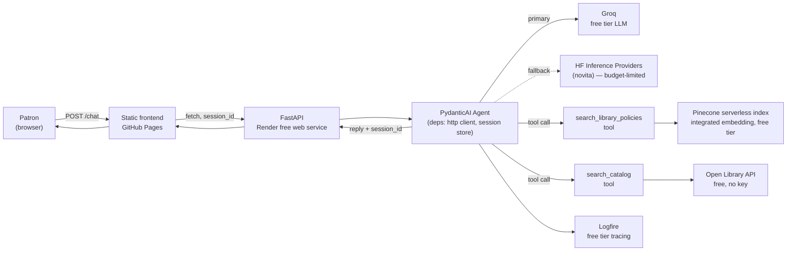
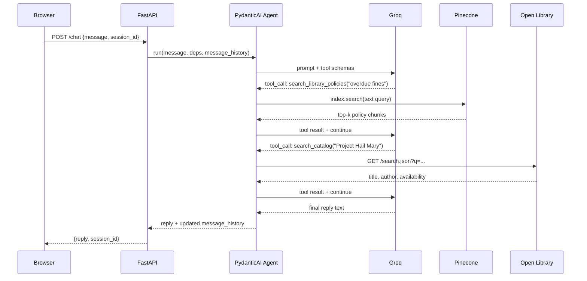

# LibSync — Tier 1: Foundation Plan

Status snapshot as of 2026-07-08. This is the durable planning doc for taking LibSync from its current
scaffold to a genuinely functioning demo, at **$0/month**, on the current stack (FastAPI + PydanticAI +
Pinecone + Render + GitHub Pages + uv). It's the foundation every later tier in this series builds on, directly
or transitively — [Tier 2](TIER2_PLAN.md) and [Tier 3](TIER3_PLAN.md) build on it directly; Tiers 4–7 inherit
it through them.

---

## 1. Where the project actually is today

The recent "Refactor to PydanticAI and uv" commit moved the backend onto FastAPI + `pydantic-ai-slim` and
`uv`, but the refactor is structural, not functional. Concretely:

| Area | State |
|---|---|
| Chat agent | `Agent` with a static system prompt (persona + RUSA/ALA text). No tools, no `deps_type`, no memory. |
| RAG / Pinecone | Index holds 10 hardcoded policy strings. `pinecone_service.query_pinecone()` requires a pre-computed `vector`, but **nothing in the codebase produces one** — the index was created via `create_index_for_model` (integrated embedding), which is queried with `index.search(query={"inputs": {"text": ...}})`, not raw vectors. `/api/query` is not actually callable end-to-end today. |
| Real library data | None. The persona claims Libby/OverDrive/Kanopy/Hoopla expertise, but those platforms have no public free API — there is no data source behind those claims. |
| Conversation | Fully stateless — one message in, one reply out, no history. |
| LLM provider | Hugging Face Inference Providers, routed through **novita** (a paid provider). Free-tier HF accounts get **$0.10/month** in Inference Provider credit — enough for roughly a handful of requests before calls start failing with a payment-required error. This is the single biggest threat to the "$0 budget" claim. |
| Frontend | `client/src/` and `docs/` (GitHub Pages) are two hand-maintained copies; they've already drifted (`script.js` differs between them). API base URL is hardcoded per copy. |
| CI/CD | `ci.yml` runs client Jest tests + server pytest on push/PR. `pinecone-iac.yml` is manual-dispatch only — nothing keeps the free Pinecone index alive (Starter-plan indexes pause after 3 weeks idle) or re-syncs content automatically. |
| Observability | `print()` statements only. No tracing of tool calls or model errors once deployed on Render. |

**Bottom line:** the plumbing (FastAPI, routers, tests, CI skeleton, uv packaging) is solid and worth keeping.
What's missing is the actual product: real retrieval, real library data, a safe LLM budget, and continuity
across a conversation.

---

## 2. Key decisions

### 2.1 Swap the primary model to Groq (keep HF as documented fallback)

- **Why:** Groq's free tier is 30 RPM / 14,400 requests/day per org, no credit card, and PydanticAI supports
  it natively (`GroqProvider` / `'groq:llama-3.3-70b-versatile'`). That's orders of magnitude safer than HF's
  $0.10/month credit ceiling on a paid-provider route (novita).
- **How:** `pydantic_ai.models.groq.GroqModel` as the primary model. Wrap primary + HF fallback in
  `pydantic_ai.models.fallback.FallbackModel` so a Groq outage doesn't take the whole demo down, and document
  both `GROQ_API_KEY` and `HUGGINGFACE_TOKEN` in `.env.example`.
- **Cost impact:** $0, and removes the realistic failure mode of the demo silently 402-ing mid-conversation.

### 2.2 Backend library data source: Open Library API

- **Why Open Library over the alternatives:**
  - Libby/OverDrive, Hoopla, Kanopy: no public developer API at any price for a hobby project (partnership-only).
  - WorldCat Search API: requires an institutional/library-system key — not available to an individual.
  - Google Books API: viable but weaker on real-time "availability" semantics and lending-style data.
  - **Open Library**: free, no API key, no auth, generous enough rate limit for a demo (1 req/s anonymous,
    3 req/s with an identifying `User-Agent`), and it has Search, Works/Editions, Covers, and an
    Availability/Read API that reports whether a title is borrowable/full-text-readable via Internet
    Archive lending — i.e. genuinely library-shaped data, not just a book metadata dump.
- **Use:** a PydanticAI tool (`search_catalog`) the agent calls when a user asks about a specific book/author,
  returning title, author, cover URL, and availability status, which the agent weaves into its reply.
- **Persona note:** keep the existing "digital media expert" persona flavor, but be explicit in the system
  prompt that concrete book lookups are backed by Open Library, not a live Libby/Hoopla catalog — avoids the
  agent confidently inventing availability info for platforms it has no data connection to.

### 2.3 Fix RAG properly, don't just wire what's there

Rewrite `pinecone_service.py` to call `index.search(namespace=..., query={"inputs": {"text": query}, "top_k": k}, fields=[...])`,
matching how the index was actually provisioned. This deletes the dead "pass me a vector" contract, removes
the need for a separate embedding call, and makes retrieval a one-argument (`text: str`) function — trivial
to expose as a PydanticAI tool (`search_library_policies`).

### 2.4 Session continuity without a database

Render's free instance sleeps/restarts and has no durable disk, so a $0-friendly design accepts that history
resets on cold start rather than adding a paid DB: an in-process `dict[session_id, list[ModelMessage]]` with
a bounded size + TTL eviction, session id minted client-side (`crypto.randomUUID()`, stored in
`localStorage`), sent as a header/body field, and passed to `agent.run(..., message_history=...)`. Document
the reset-on-cold-start limitation in the README rather than hiding it.

### 2.5 Observability: Pydantic Logfire (free Hobby tier)

Native one-line integration with PydanticAI (`logfire.instrument_pydantic_ai()`), free tier is generous
enough for a low-traffic demo, replaces `print()` debugging with real traces of tool calls / retries / token
usage — makes "is this actually working" answerable without SSH-ing into Render logs.

---

## 3. Target architecture

Request flow for a single turn:

---

## 4. Budget ledger (must stay at $0)

| Service | Free-tier ceiling | Current risk |
|---|---|---|
| Groq (LLM) | 14,400 req/day, 30 RPM, no card | Low |
| Hugging Face (fallback LLM) | $0.10/mo Inference Provider credit via novita | High if used as primary — fallback-only |
| Pinecone Starter | 2GB storage, 2M write / 1M read units/mo, index pauses after 3 weeks idle | Medium — needs a keep-alive job |
| Open Library API | No key; 1 req/s anon, 3 req/s with `User-Agent` | Low — add in-memory caching to stay polite |
| Render free web service | 750 instance-hrs/mo, 5GB bandwidth/mo (cut from 100GB in Apr 2026), sleeps after 15 min idle | Medium — watch bandwidth on the reduced quota |
| GitHub Pages | Static hosting, effectively unlimited for this traffic | Low |
| Logfire free (Hobby) | Generous span quota for low-traffic use | Low |

Action item: add a monthly checklist (or a scheduled GH Action that just does a lightweight ping/search) to
confirm Pinecone and Render haven't been auto-paused, and to sanity-check Render bandwidth isn't creeping
toward the 5GB cap.

---

## 5. Phased roadmap

### Phase 0 — De-risk the budget (0.5–1 day)
- Swap primary model to Groq; wrap with `FallbackModel(groq_model, hf_model)`.
- Add `GROQ_API_KEY` to `.env.example`, README setup steps, Render env vars.
- **Done when:** a full conversation runs entirely on Groq; HF path is exercised only via a forced-failure test.

### Phase 1 — Make RAG real (2–4 days)
- Rewrite `pinecone_service.py` around `index.search(text=...)`; delete the unused vector contract.
- Register `search_library_policies` as an `@agent.tool` with `RunContext[LibSyncDeps]`.
- Expand Pinecone content past the 10 seed rows (more realistic FAQ/policy coverage — still synthetic, still free).
- Rewrite `/api/query` and its tests around the text-based contract.
- **Done when:** asking "how much are late fees?" in `/chat` visibly triggers a Pinecone tool call (verified via Logfire or a test asserting tool invocation) and the fee amount in the reply matches the indexed record.

### Phase 2 — Real library data (Open Library) (3–5 days)
- Add `LibSyncDeps` dataclass (shared `httpx.AsyncClient` via FastAPI lifespan) and `search_catalog` tool.
- Call Search API for lookups, Availability API for borrow status, Covers API for cover image URLs.
- Add a small in-memory TTL cache in front of Open Library calls (courtesy + resilience).
- Update persona prompt to be explicit about what's real-catalog vs. flavor text.
- **Done when:** asking "is Project Hail Mary available?" returns a real title/author/cover from Open Library, not a hallucinated answer.

### Phase 3 — Conversation continuity & UX (2–4 days)
- Server: session store (`dict[str, list[ModelMessage]]`, bounded + TTL) threaded through `message_history`.
- Frontend: mint/persist `session_id` in `localStorage`; send with every request.
- Frontend: unify the two divergent copies — single `config.js` for API base URL, add a sync step (npm script or a GH Action step) so `docs/` is generated from `client/src/` instead of hand-edited.
- UX: retry/backoff on fetch failure, distinguish "rate limited" vs "service down" errors, render book-lookup results as a distinct card instead of plain prose.
- **Done when:** a 3-turn conversation ("recommend a sci-fi book" → "is it available?" → "what about the audiobook") stays coherent, and reloading the page keeps the same session id.

### Phase 4 — Observability, hardening, docs (2–4 days)
- Add Logfire (`logfire.configure()` + `instrument_pydantic_ai()` + `instrument_fastapi()`).
- Add a scheduled GH Action (weekly) that pings Pinecone and Render to prevent free-tier idle pauses.
- Write `ARCHITECTURE.md` (the diagrams from §3, plus a short "why these choices" section) and `CONTRIBUTING.md`.
- Update `README.md` "Next Steps" — remove completed items, replace with real remaining scope.
- Expand tests: tool-invocation assertions (via `TestModel`/`FunctionModel` capturing tool calls), Open Library client tests against recorded fixtures (no live calls in CI).
- **Done when:** CI covers agent tool selection, not just endpoint status codes; someone unfamiliar with the repo can read `ARCHITECTURE.md` and understand the request flow without reading code.

### Phase 5 — Polish (optional, ongoing)
- Streaming replies (`agent.run_stream` + incremental fetch/SSE) to offset Render cold-start latency.
- Structured output (`output_type=str | BookResult`) for a cleaner UI contract instead of prose-embedded results.
- Screenshots/demo GIF in README for portfolio presentation.

---

## 6. Definition of "fully functioning prototype"

- A user can ask a policy question and get an answer grounded in the real Pinecone index (not just system-prompt text).
- A user can ask about a real book and get a real answer from Open Library, including availability.
- A multi-turn conversation holds context within a session.
- The demo can run indefinitely at $0/month without silently breaking (Groq budget headroom, Pinecone kept alive, Render bandwidth watched).
- Tests assert on agent *behavior* (which tool fires, on what input) not just HTTP status codes.
- `ARCHITECTURE.md` + updated `README.md` let a stranger understand and run the system.

Once this bar is met, [TIER2_PLAN.md](TIER2_PLAN.md) covers what comes next: a research/citation assistant
backed by OpenAlex and Crossref, and an AG-UI-based interactive frontend for rendering book/research/citation
results as real UI instead of prose — still at $0/month.
