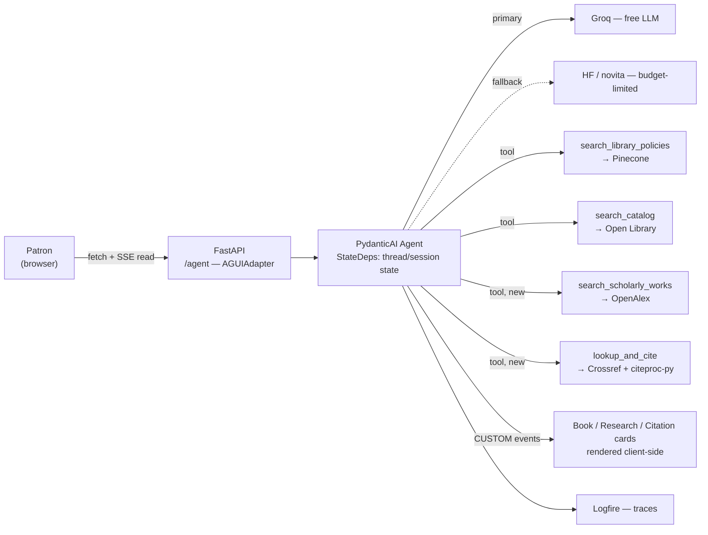

# LibSync — Tier 2: Interactive & Research-Grade Enhancements

Builds on [TIER1_PLAN.md](TIER1_PLAN.md) (Tier 1). **Start this once Tier 1's Definition of Done
is met** — Tier 2 assumes real RAG, a real catalog tool, a budget-safe model, and session continuity already
exist. Tier 2 turns LibSync from "answers questions in a text box" into "a research tool with a real
interface," still at $0/month.

Two questions drove this doc, researched directly rather than assumed:

1. *What do library-adjacent sites/services actually offer for free right now* — beyond Open Library.
2. *What does "interactive/agentic UI" mean in mid-2026* — what would displaying a book or a citation as a
   clickable card actually run on.

---

## 1. What's out there: free library & research data sources

| Source | Free tier | What it adds LibSync doesn't have |
|---|---|---|
| **Open Library** *(Tier 1, keep)* | No key, 1–3 req/s | Book search, availability, covers |
| **OpenAlex** | Free API key, ~$1/day-equivalent credit, 250M+ works | Scholarly search, citation counts, related/cited-by works, open-access flags — the actual "research help" data source |
| **Crossref REST API** | Free, keyless (add `mailto=` for the polite pool) | Canonical bibliographic metadata by DOI or title — author, year, title, container-title, volume/issue/pages, publisher. Ground truth for citation *fields*. |
| **citeproc-py** + **citeproc-py-styles** | Free, open-source (CSL 1.0.1 processor + real APA/MLA/Chicago/etc. style files from the citationstyles.org repo) | Deterministic citation *formatting*. Not an API — a library that follows the actual style spec instead of the model recalling it from memory. |
| **Unpaywall** | Free, keyless (`email=` param required), 100k calls/day | "Is there a free, legal full-text copy of this paper?" — good complement to research help |
| **DPLA** | Free API key (self-service, no gatekeeping) | 15M+ digitized items from US libraries/archives/museums — primary sources, not just books |
| **Library of Congress (loc.gov)** | No key, rate-limited | Historic newspapers, manuscripts, prints/photos |

**Scope call:** build OpenAlex + Crossref/citeproc into Tier 2 as core features (Phases 7–8 below) — they
directly answer "research help" and "citation questions." Unpaywall, DPLA, and LoC are documented as a
**Tier 3 / stretch** list at the end rather than built now — adding all five research APIs at once is scope
creep the roadmap doesn't need yet.

Why Crossref+citeproc instead of just asking the model to format a citation: the model doesn't reliably know
that Chicago 17th uses a different page-range em dash than APA 7th, or which CSL style guide governs "et al."
thresholds per style. Citeproc-py runs the *actual* CSL style XML — the same processor family Zotero uses —
so a citation is either right or the style file is missing, never "plausible-sounding."

---

## 2. What "interactive UI" means right now, and which one fits

Two real, competing specs exist for agent-to-frontend interactivity in 2026. They solve different problems:

| | **AG-UI** (Agent-User Interaction Protocol) | **MCP Apps / MCP-UI** |
|---|---|---|
| What it is | Event-based streaming protocol (SSE): messages, tool-call events, state deltas, custom events, from an agent backend to *your own* frontend | Official MCP extension (Jan 2026): a tool declares a UI resource; the *MCP host* renders it in a sandboxed iframe |
| Who it's for | An app that owns both its backend agent and its frontend | A generic MCP client (Claude Desktop, ChatGPT, etc.) rendering a *third-party* tool's UI safely |
| PydanticAI support | First-party: `pydantic_ai.ui.ag_ui.AGUIAdapter`, built with CopilotKit | None — LibSync isn't an MCP server today |
| Frontend requirement | None — plain `fetch` + a stream reader, no React needed | Requires acting as/being embedded in an MCP host with iframe sandboxing |
| Adoption | Google, Microsoft, Amazon (Bedrock AgentCore), Oracle | OpenAI Apps SDK, Shopify, Anthropic |

**Decision: adopt AG-UI, not MCP Apps.** LibSync's frontend is first-party and already trusted by its own
backend — MCP Apps' sandboxed-iframe model exists to protect a *generic* host from an *untrusted third-party*
tool, which isn't LibSync's situation. AG-UI solves the actual problem (stream tool-call progress and
structured card data to a UI you control) and PydanticAI ships an adapter for it directly, so there's no new
heavy dependency — just `pydantic-ai-slim[ag-ui]`.

(If LibSync's backend is ever exposed *as* an MCP server so other agents/assistants can use its catalog and
citation tools, MCP Apps becomes relevant again — worth a one-line note in `ARCHITECTURE.md` as a future
door, not a current task.)

### What AG-UI actually looks like wired up

```python
# pip install 'pydantic-ai-slim[ag-ui]'
from fastapi import FastAPI
from starlette.requests import Request
from starlette.responses import Response
from pydantic_ai.ui.ag_ui import AGUIAdapter

app = FastAPI()

@app.post("/agent")
async def run_agent(request: Request) -> Response:
    return await AGUIAdapter.dispatch_request(request, agent=chat_agent)
```

This replaces `POST /chat` (plain JSON in/out) with a streamed SSE response: token-by-token text,
`TOOL_CALL_START` / `TOOL_CALL_RESULT` events as `search_catalog` or `search_scholarly_works` fire, and
custom events a tool can attach via `ToolReturn` for structured payloads (a book's cover/availability, a
formatted citation) that the frontend renders as a real card instead of prose.

Frontend side: AG-UI requests are POST (they carry thread id, message history, shared state), so the browser
can't use a bare `EventSource` (GET-only) — read the stream with `fetch()` + a `ReadableStream` reader that
splits on SSE `data:` lines, no framework required. Rendering stays hand-rolled vanilla JS: a small event
router (`switch` on event type) that appends text deltas to the active message bubble and mounts a card
component when a `CUSTOM` event with a known payload shape arrives.

**Session note:** AG-UI's `RunAgentInput` already carries a thread id and shared state. Tier 1 Phase 3's
bespoke `session_id → message_history` dict can collapse into this — use the AG-UI thread id as the session
key instead of inventing a parallel one.

---

## 3. New capabilities

### 3.1 Interactive book cards (upgrade, not new)
Tier 1's `search_catalog` tool already returns Open Library data as text folded into the reply. Tier 2
upgrades it to emit an AG-UI custom event carrying a `BookCard` payload (title, author, cover URL,
availability, Open Library link) that the frontend renders as an actual card: cover image, availability
badge, expandable description, a real link out — not a bullet point.

### 3.2 Research assistant (`search_scholarly_works`, new)
New tool over OpenAlex: given a topic or a paper title, return ranked works with title, authors, year,
citation count, open-access flag, and (optionally) "works that cite this" / "works this cites" for
follow-up questions. Rendered as a result-list card, each entry expandable to its abstract.

### 3.3 Citation assistant (`lookup_and_cite`, new)
Two-step, both grounded in real data:
1. Resolve the work via Crossref (by DOI if the user has one, else title search) — real bibliographic fields, not recalled from the model's memory.
2. Format it with citeproc-py against the real CSL style file for whatever style the user asks for (APA, MLA, Chicago, etc.).

Returned as a citation card: formatted citation text, a copy-to-clipboard button, a style switcher (APA/MLA/Chicago) that re-runs citeproc client-triggered/server-side without re-resolving Crossref, and a link to the source DOI.

### 3.4 Stretch (Tier 3, not built now)
Unpaywall ("is there a free legal copy of this?"), DPLA and LoC (primary-source/archival search) — same tool
pattern as 3.1–3.3, deferred so Tier 2 stays shippable.

---

## 4. Updated architecture



---

## 5. Roadmap (continues Tier 1's phase numbering)

### Phase 6 — AG-UI transport migration (3–5 days)
- Add `pydantic-ai-slim[ag-ui]`; mount `AGUIAdapter.dispatch_request` at `/agent`.
- Rewrite frontend fetch call into a `fetch` + `ReadableStream` SSE reader with an event-type router.
- Collapse Tier 1's session dict onto the AG-UI thread id via `StateDeps`.
- Keep `/chat` alive during transition (feature-flag or parallel route) so the migration can land incrementally without breaking the working Tier 1 demo mid-phase.
- **Done when:** a streamed reply renders token-by-token in the UI, and a tool call shows a visible "searching…" state while it runs.

### Phase 7 — Research assistant (3–5 days)
- OpenAlex client (`httpx`, injected via deps, free API key + polite-pool email), `search_scholarly_works` tool.
- `ScholarlyWork` card payload + frontend result-list component (title/authors/year/citations/OA badge, expandable abstract).
- **Done when:** "find recent papers on X" returns a real, clickable result list with correct OA flags.

### Phase 8 — Citation assistant (4–6 days)
- Crossref client (`httpx`, `mailto=` polite pool) for DOI/title → bibliographic record.
- `citeproc-py` + `citeproc-py-styles` wired for APA/MLA/Chicago at minimum.
- `lookup_and_cite` tool returning a citation card with a style switcher.
- **Done when:** asking "cite this in MLA" for a real paper produces a citation that matches a manual MLA formatting of the same Crossref record.

### Phase 9 — Book card polish + stretch APIs (2–4 days core, open-ended for stretch)
- Upgrade `search_catalog`'s output to a proper `BookCard` custom event (cover, availability badge, link).
- Optional: Unpaywall open-access lookup, DPLA/LoC primary-source search, same tool pattern as above.
- **Done when:** every book mentioned in a reply is a real card, not inline prose.

---

## 6. Testing additions

- Mock the AG-UI event stream in tests (assert `TOOL_CALL_START`/`RESULT` sequence and custom-event payload shape) rather than only asserting on final text, matching Tier 1's existing tool-call-assertion pattern.
- Citeproc output tests: golden-file comparison against manually verified APA/MLA/Chicago citations for a small fixed set of known DOIs — catches CSL style regressions, not just "did it return a string."
- Crossref/OpenAlex clients: recorded-fixture tests in CI (no live network calls), same pattern as the Open Library client from Tier 1.

---

## 7. Budget ledger addendum

| Service | Free-tier ceiling | Notes |
|---|---|---|
| OpenAlex | Free key, ~$1/day-equiv credit, 100k req/day historically | Register with a real email for the polite pool |
| Crossref | Free, keyless | Add `mailto=` param, don't hammer without it |
| citeproc-py | N/A — local library, no network cost | — |
| Unpaywall (stretch) | Free, keyless, 100k/day | Requires `email=` param |
| DPLA (stretch) | Free key, effectively unthrottled | Self-service signup |
| Library of Congress (stretch) | Free, keyless | Rate-limited, be polite |

All additions are $0. Nothing in Tier 2 changes the Tier 1 budget risk profile — Groq stays primary, HF stays fallback-only.

---

## 8. Definition of done for Tier 2

- A book mentioned in chat renders as a real interactive card, not a text description.
- A research question returns actual OpenAlex results with correct open-access flags — not invented papers.
- A citation request produces a citation traceable to a real Crossref record, formatted by a real CSL style file, in more than one style.
- The chat UI streams — the user sees tokens and tool-call progress live, not a single blocking response.
- All of the above still runs at $0/month.

Once this bar is met, [TIER3_PLAN.md](TIER3_PLAN.md) covers the presentation layer on top of it: surfacing
Tier 2's tool calls and grounded sources visibly in the UI, a real card design system, and an accessibility
pass — in LibSync's existing black-and-amber brand.
