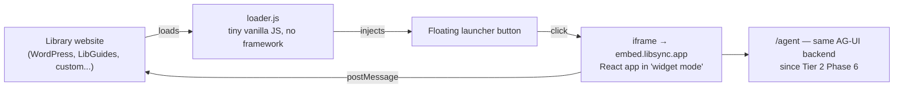

# LibSync — Tier 6: Embeddable Library Widget

Builds on [TIER4_PLAN.md](TIER4_PLAN.md) (React component library). Tier 6 packages LibSync as a small
snippet any library's existing website can drop in — the same shape as Intercom, Drift, or Tawk.to — so a
library doesn't need to send patrons to a separate LibSync site at all.

This is a **different deployment target of the same components**, not a new product. It can be built in
parallel with Tier 5 rather than strictly after it; it doesn't need Tier 5's multi-conversation sidebar (a
floating widget has no room for one — see §3).

---

## 1. Isolation: iframe, not Shadow DOM

Two real approaches exist for third-party embeds, and they solve different problems:

| | iframe | Shadow DOM |
|---|---|---|
| Isolation | Full — separate browsing context, no CSS/JS leakage either direction | Style-only — a closed shadow root stops CSS bleeding, but shares the JS global scope and event loop |
| Best fit | Content served from a different domain than the host, whose styling you don't control | Content you control tightly integrated into a page you also control |
| Overhead | A full browsing context per instance — real but small for a single widget | Lighter — no second document/rendering context |

**Decision: iframe.** Library websites run wildly heterogeneous, uncontrolled platforms — WordPress, Drupal,
LibGuides, custom ILS-integrated sites, a decade of accumulated global CSS in some cases. LibSync doesn't
control any of it and is served from a different domain than every host site. That's exactly the case the
research consistently points to iframe for: strong isolation by default, no risk of a host site's global
styles (or LibSync's own CSS) bleeding across the boundary in either direction.

---

## 2. Architecture



- **`loader.js`**: a deliberately tiny, dependency-free vanilla JS snippet — it has to load fast and safely on
  someone else's site, so it stays outside the React bundle entirely. Its only job is injecting the launcher
  button and, on click, the iframe.
- **Widget mode**: the *same* React app from Tier 4/5, rendered with a `?mode=widget` (or subdomain) flag that
  hides the sidebar and history list, shows a compact single-conversation view, and uses `CopilotPopup` from
  `@copilotkit/react-ui` — which is already built for exactly this shape (a floating button that opens a chat
  window) — instead of a hand-rolled launcher/panel.
- **`postMessage`**: the only sanctioned cross-boundary channel — used for things like resizing the iframe to
  fit content and letting the host page close the widget, nothing more invasive.

---

## 3. Embed snippet & customization

```html
<script src="https://embed.libsync.app/loader.js" data-library="example-library" data-accent="#ffd166" async></script>
```

- `data-library`: identifies which library's config/branding to load (name, tagline) — not an auth secret, see §4.
- `data-accent` (optional): lets a library nudge the launcher button color to match their own site without
  touching LibSync's actual app theme, which stays black/amber inside the iframe.
- Position (`bottom-right` default, `bottom-left` optional) and initial open/closed state are similarly
  data-attribute configurable — the standard pattern for this class of widget.

---

## 4. Protecting the $0 budget from an open embed

Tier 1's budget ledger already flagged Groq/Pinecone/Render free-tier ceilings. An embeddable widget makes the
backend reachable from *any* site that adds the snippet — worth protecting deliberately rather than
discovering the hard way:

- CORS is already wide open (`allow_origins=["*"]` in `main.py`) — necessary for an unknown set of embedding
  domains, but combine it with:
- **Per-origin rate limiting**, not just per-IP: extend Tier 1's `slowapi` limiter to key on `Origin` header in
  addition to remote address, so one misbehaving or abusive embed can't consume the shared Groq/Pinecone
  headroom for every other library using the widget.
- **A lightweight registration step** (still $0 — just an allowlist, no billing): a library requests a
  `data-library` id before their embed starts working, giving a natural point to cut off abuse without
  building real multi-tenant auth.

---

## 5. Roadmap (continues Tier 1–5's phase numbering)

| Phase | Scope | Est. |
|---|---|---|
| **23** | `loader.js` + widget-mode React build (`CopilotPopup`-based), served as a static embed target | 3–5 days |
| **24** | `postMessage` contract for resize/close; per-origin rate limiting on the backend | 2–3 days |
| **25** | Customization (`data-accent`, position) + lightweight library-id registration/allowlist | 2–3 days |

**Done when:** a two-line snippet on a test WordPress/static-HTML page renders a working, on-brand chat
launcher with no visible CSS collisions in either direction, and the backend rejects requests from
unregistered origins beyond a small grace quota.

---

## 6. Budget ledger addendum

| Item | Cost |
|---|---|
| `loader.js` + widget-mode hosting | $0 — same Render/GitHub Pages infra as Tiers 1–5 |
| Per-origin rate limiting | $0 — `slowapi`, already in the stack |
| Registration/allowlist | $0 — no auth provider needed for a simple id allowlist |

---

## 7. Definition of done

- The widget embeds cleanly on a page LibSync doesn't control, with zero CSS bleed in either direction.
- The launcher and panel are on-brand (black/amber) regardless of the host site's own styling.
- Backend usage from embedded widgets is rate-limited per origin, not just per IP — the $0 budget survives
  wide adoption, not just a single demo site.

Once this bar is met, [TIER7_PLAN.md](TIER7_PLAN.md) covers wrapping the Tier 5 standalone app for iOS and
Android — the last of the three platforms requested alongside this tier.
