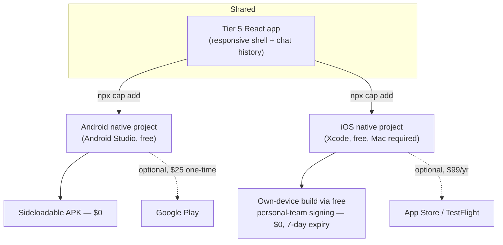

# LibSync — Tier 7: Mobile Apps (iOS & Android)

Builds on [TIER5_PLAN.md](TIER5_PLAN.md) (the full responsive standalone app — Capacitor wraps *that*, not
the original fixed-width widget, so the native shell gets a real full-screen app rather than a small card).

**Read this section before the rest of the plan — it changes what "done" means:**

> Every other tier in this series holds to a hard $0/month budget, no exceptions. Native app store
> distribution genuinely cannot: the **Apple Developer Program is $99/year** (required for App Store or even
> TestFlight distribution to real users) and **Google Play Console is a $25 one-time fee**. Building, testing
> on your own device, and sideloading are free; putting the app in front of the public on the App Store is
> not. This tier gives a $0-complete path (PWA install + free sideloading, real and useful on its own) and
> clearly marks store publication as an explicit, separately-decided cost — not something to build toward
> quietly and discover the bill for at the end.

---

## 1. Build tool: Capacitor, not React Native

| | Capacitor | React Native |
|---|---|---|
| What it does | Wraps an *existing* web app in a native shell (native webview + JS bridge for device APIs) | A separate UI framework — its own components (`View`, `Text`, ...) replace DOM elements |
| Code reuse from Tier 4/5 | ~100% of the existing React app | Near zero — UI layer gets rewritten from scratch |
| Effort | Wrap, configure, ship | A second frontend to build and maintain in parallel with the web app |

**Decision: Capacitor.** This project's whole trajectory has been "build once, reuse everywhere" — Tier 6's
widget reuses Tier 4's components; Tier 7 should too. React Native would mean maintaining two UIs
(`web` and `native`) that drift, exactly the kind of problem Tier 1/3/4 kept finding and fixing (the
`client/src`/`docs/` drift bug, three separate times). Capacitor avoids creating a fourth version of that
problem.

---

## 2. What's actually free vs. what costs money

| Task | Cost |
|---|---|
| Add Capacitor to the Tier 5 app, generate iOS/Android native projects | $0 |
| Build & run on an Android emulator or your own Android device (APK sideload) | $0 |
| Build & run on your own iOS device via Xcode's free personal-team signing | $0 (app expires after 7 days, reinstall to renew — a real limitation, not a workaround-able one, without paying) |
| Distribute an Android APK directly (outside Google Play) | $0 |
| Publish to Google Play | $25 one-time |
| Publish to the App Store / use TestFlight for wider beta testing | $99/year |
| Building for iOS at all | Requires a Mac (Xcode is Mac-only) — a hardware/environment requirement, not a subscription cost, but worth stating plainly since it's not optional |

**The $0-complete deliverable for this tier is: Tier 5's PWA (already installable, from Tier 5 Phase 22) plus
a Capacitor-built Android APK anyone can sideload, plus an iOS build any developer can run on their own device
via Xcode.** That is a real, working "mobile app" on both platforms — it just isn't discoverable in a public
store without the fees above.

---

## 3. Architecture

---

## 4. Roadmap (continues Tier 1–6's phase numbering)

| Phase | Scope | Est. | Cost |
|---|---|---|---|
| **26** | Add Capacitor to the Tier 5 app; generate Android project; build and sideload a working APK | 2–4 days | $0 |
| **27** | Generate iOS project; build and run on a personal device via free Xcode signing; document the 7-day resign cadence | 2–4 days | $0 (requires a Mac) |
| **28** | Native polish: app icons, splash screen, status bar theming to match LibSync's black/amber brand, safe-area handling | 2–3 days | $0 |
| **29** *(optional, explicit decision point)* | Pay the Apple/Google fees and submit to the App Store / Google Play | 1–2 days + review time | **$99/yr + $25 one-time** |

**Done when ($0 bar):** a sideloaded Android APK and a personally-signed iOS build both run the full Tier 5
app natively, matching its web behavior.
**Done when (published, optional):** the app is live and installable from the App Store and Google Play — only
attempt this phase after an explicit decision to spend the $124 (first year), since it's the one place this
entire plan series intentionally leaves the $0 constraint.

---

## 5. Budget ledger addendum

| Item | Cost | Required for $0-complete? |
|---|---|---|
| Capacitor, Android Studio, Xcode | $0 | Yes |
| Android APK sideload | $0 | Yes |
| iOS personal-device build | $0 (7-day expiry) | Yes |
| Google Play Console | $25 one-time | No — Phase 29 only |
| Apple Developer Program | $99/year | No — Phase 29 only |

---

## 6. Definition of done

- **$0 tier:** the Tier 5 app runs as a native-shell app on a sideloaded Android device and a personally-signed
  iOS device, with brand-correct icons/splash/status bar.
- **Published tier (optional, costs money, needs an explicit go-ahead):** live on the App Store and Google
  Play.

This closes the four platform-expansion tiers requested alongside the React migration: Tier 4 (React) → Tier 5
(standalone app + history) → Tier 6 (embeddable widget) → Tier 7 (mobile). All four share one React component
library; none of them duplicate UI work the others already did.

From here, [TIER8_PLAN.md](TIER8_PLAN.md) covers the librarian-facing side: a management dashboard for
connecting a library's own catalog, uploading their own policy documents, and viewing usage statistics — the
first tier that introduces real accounts (for staff, not patrons) and a database.
