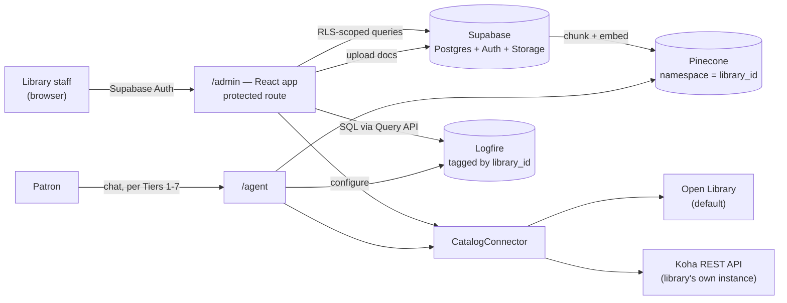

# LibSync — Tier 8: Developer, Manager & Statistics Dashboard

Builds on [TIER1_PLAN.md](TIER1_PLAN.md) (Pinecone integrated-embedding index, Logfire instrumentation),
[TIER4_PLAN.md](TIER4_PLAN.md) (React component library, protected-route capable), and
[TIER6_PLAN.md](TIER6_PLAN.md) (the `data-library` id concept, which becomes a real tenant identifier here).

**The use case:** a library runs its own instance of LibSync and wants to connect it to its own catalog/records,
upload its own policy documents, see usage statistics, and manage all of that through a dashboard — without
touching code. That requires **real multi-tenancy**, which this series has deliberately avoided until now
because nothing before this needed accounts. This tier introduces them for **library staff**, not patrons —
patrons still never need an account; only the people managing an instance do.

---

## 1. What changes structurally, and why it's fine to change now

Every prior tier avoided a database and accounts on purpose — Tier 1 explicitly chose an in-memory session
dict *because* Render's free tier has no durable disk and adding a database wasn't justified by what existed
then. A dashboard that persists tenant configuration, uploaded documents, and staff logins is a genuine,
irreducible requirement for a database — not scope creep, an actual different problem. This tier adds the
smallest thing that satisfies it, not a general-purpose backend platform.

---

## 2. Key decisions

### 2.1 Multi-tenancy → one Pinecone namespace per library

**Why:** this is Pinecone's own documented recommendation for multi-tenant RAG (physical data isolation,
independent scaling per tenant, and clean offboarding — delete a namespace, the tenant's data is gone). It's
also already the *shape* of the existing code: `pinecone-scripts/upsert_pinecone_records.py` already has a
`NAMESPACE = "ns1"` constant — Tier 1 already namespaced the data, just to a single hardcoded value.
**How:** replace the hardcoded `"ns1"` with the library's tenant id everywhere Pinecone is touched (the
`search_library_policies` tool, the IaC upsert scripts). No new Pinecone concept — parameterizing an existing one.

### 2.2 Tenant config, staff auth, and document storage → Supabase (free tier)

**Why:** one service instead of three. Supabase's free tier bundles Postgres (tenant config, with Row-Level
Security scoping every query to the logged-in staff member's own library — the standard, documented pattern
for multi-tenant Postgres), Auth (staff login), and Storage (uploaded policy documents before they're chunked
into Pinecone) — versus separately wiring a database, an auth provider, and a file store.
**How:** one `libraries` table (id, name, branding, catalog connector config), RLS policies keyed on
`auth.uid()` → staff-to-library mapping, Storage bucket for raw document uploads.
**Budget note (watch item, same pattern as Pinecone/Render elsewhere in this series):** free Supabase projects
pause after 1 week of inactivity (same failure mode as Pinecone Starter and Render's free web service — fold
into the existing weekly keep-alive GitHub Action from Tier 1 Phase 4) and the free tier caps at 500MB
database storage, which is generous for tenant config but worth watching as staff-account count and document
metadata grow across many libraries.

### 2.3 Statistics → query Logfire, don't build a parallel analytics pipeline

**Why:** Tier 1 Phase 4 already instruments every tool call, model request, and error through Logfire.
Building a second event-logging system to power a stats dashboard would duplicate data that already exists.
Logfire ships a real Query API (`LogfireQueryClient`, arbitrary SQL against logged spans, JSON/CSV/Arrow
export) built for exactly this.
**How:** tag spans with the library id at the point tools already run (one attribute addition, not a new
system), then build dashboard charts as SQL queries against Logfire via its Query API: conversation volume,
tool-usage breakdown (policy vs. catalog vs. research vs. citation), error/unanswered rate, and — tying back
to this entire series' budget obsession — usage against the shared free-tier ceilings (Groq requests/day,
Pinecone read/write units, Render bandwidth) surfaced directly in the dashboard instead of living only in
planning docs.

### 2.4 Catalog integration → a pluggable connector, Koha first

**Why:** "hook up their own library records" means real ILS integration, not just Open Library. Of the real
options — Koha, Evergreen (both open-source), SirsiDynix, Ex Libris Alma, Polaris, III Sierra (commercial) —
**Koha** is the right first target: open-source, a documented REST API (Mojolicious + Swagger2, OAuth2/basic
auth, patron and item endpoints), and widely deployed at public libraries, so it's realistic for a demo
library to actually have one to test against.
**How:** a `CatalogConnector` interface with one method shape (`search`, `availability`) and two
implementations to start: `OpenLibraryConnector` (today's default, Tier 1) and `KohaConnector` (base URL + API
key entered by library staff in the dashboard). `search_catalog` picks the configured connector per tenant
instead of always calling Open Library.
**Noted, not built:** SIP2 and NCIP are the real standard protocols for live circulation data (checked-out
items, holds, fines) — SIP2 is the de facto self-service-terminal standard, NCIP is its NISO-standardized
successor for broader interlibrary transactions. Both are real and worth knowing about, but they're
patron-authenticated, session-oriented protocols aimed at circulation, not catalog search — a materially
deeper integration than a REST connector. Flagged as future/stretch, not Tier 8 scope.

### 2.5 Developer surface → API keys + the API you already have

**Why:** "developer" access mostly means two things: a credential, and documentation. FastAPI already
generates interactive API docs (`/docs`) for free — nothing new to build there.
**How:** extend Tier 6's `data-library` allowlist concept into a real per-library API key (issued from the
dashboard, revocable), and link the existing `/docs` Swagger UI from the dashboard instead of building a
parallel reference. Optional: a webhook URL a library can configure to be notified when a patron thumbs-downs
a reply (Tier 3's feedback action) — a real, low-effort escalation path to a human librarian.

### 2.6 Dashboard UI → a protected route in the existing app, not a new app

**Why:** consistent with every prior tier's "one component library, no duplicated UI work" principle.
**How:** `/admin` route in the Tier 4 React app, gated by Supabase Auth, reusing Tier 3's design tokens.
Introduces client-side routing (React Router or TanStack Router) — the first tier that actually needs it,
since everything before was a single view.

---

## 3. What it looks like

Mockups, not screenshots — nothing here is built yet — but concrete enough to build from, in the same brand
as the patron-facing app with a dashboard's own chrome (no floating-widget glow; this is a workspace).

**Overview** — the statistics dashboard from §2.3: conversation volume, tool-call breakdown, and — the
throughline of this entire series — free-tier headroom for Groq, Pinecone, and Render surfaced directly where
staff will actually see it, not buried in a planning doc.

**Documents** — the upload/management UI from Phase 31: drag-and-drop, and a status per document (embedded,
processing, or error) so a librarian can tell at a glance whether something actually made it into their
namespace.

**Catalog connector** — the actual "hookup," from §2.4: choosing Koha over the Open Library default, entering
the library's own base URL and API key, and a live test-connection result before saving.

---

## 4. Architecture

---

## 5. Roadmap (continues Tier 1–7's phase numbering)

| Phase | Scope | Est. |
|---|---|---|
| **30** | Supabase project: `libraries` table + RLS, staff auth, parameterize Pinecone namespace (`"ns1"` → `library_id`) everywhere it's hardcoded | 4–6 days |
| **31** | Document management UI: upload → Storage → chunk/embed into the tenant's namespace, replacing the manual `pinecone-scripts` workflow with a per-tenant, UI-driven one | 4–6 days |
| **32** | `CatalogConnector` abstraction + `KohaConnector` implementation + per-library connector config UI | 5–7 days |
| **33** | Statistics dashboard: tag Logfire spans with `library_id`; build usage/error/budget-headroom views via the Logfire Query API | 3–5 days |
| **34** | Developer surface: per-library API key issuance, link `/docs`, optional escalation webhook | 2–3 days |
| **35** *(stretch, not scoped here)* | SIP2/NCIP live-circulation connector for patron-specific data | — |

**Done when:** a second (test) library can be fully onboarded through the dashboard — its own namespace, its
own uploaded documents, its own catalog connector, its own stats view — with zero code changes and zero
visibility into the first library's data.

---

## 6. Budget ledger addendum

| Item | Free-tier ceiling | Risk |
|---|---|---|
| Supabase (Postgres + Auth + Storage) | 500MB DB, 50k MAU auth, 1GB file storage, pauses after 1wk idle | Medium — same keep-alive pattern as Pinecone/Render; watch DB size as tenants grow |
| Pinecone namespaces | up to 100k namespaces before Support contact needed (Standard/Enterprise) | Low at pilot scale |
| Logfire Query API | same free Hobby quota as Tier 1's tracing | Low |
| Koha connector | $0 — calls the library's own existing Koha instance, no new service on LibSync's side | Low |

**Honest framing, consistent with this series' existing "watch items" (Pinecone Starter pausing, Render
bandwidth):** this tier is genuinely $0 for a pilot — one library, modest usage. Unlike Tier 7's app-store
fees (a hard, unavoidable cost), Supabase's ceilings are the same kind of "free tier that needs occasional
attention" as several services already in this stack, not a new category of cost.

---

## 7. Definition of done

- Library staff log in and see only their own library's data — enforced by RLS, not just UI hiding.
- A librarian can upload a policy document and have it searchable in chat within their own Pinecone namespace, with no code changes.
- A librarian can point catalog search at their real Koha instance instead of Open Library.
- A stats view shows real usage — conversation volume, tool breakdown, error rate, and free-tier budget headroom — sourced from Logfire, not a second logging system.
- Patron-facing behavior across Tiers 1–7 is completely unaffected — this tier is additive, staff-only.

From here, [TIER9_PLAN.md](TIER9_PLAN.md) covers the patron side: real accounts, optional and additive, built
on the `CatalogConnector` and Supabase Auth this tier introduces — "sign in with your library card" is only
possible because a library's ILS is now a first-class concept in the system.
