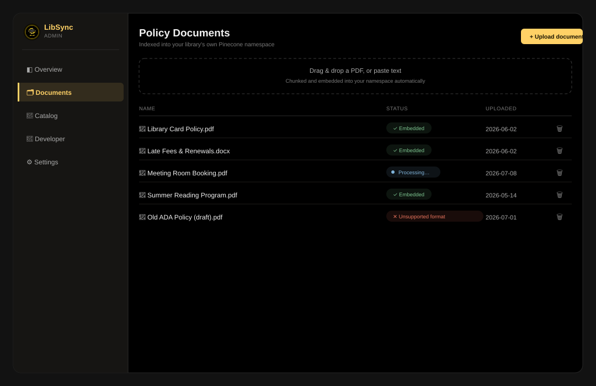
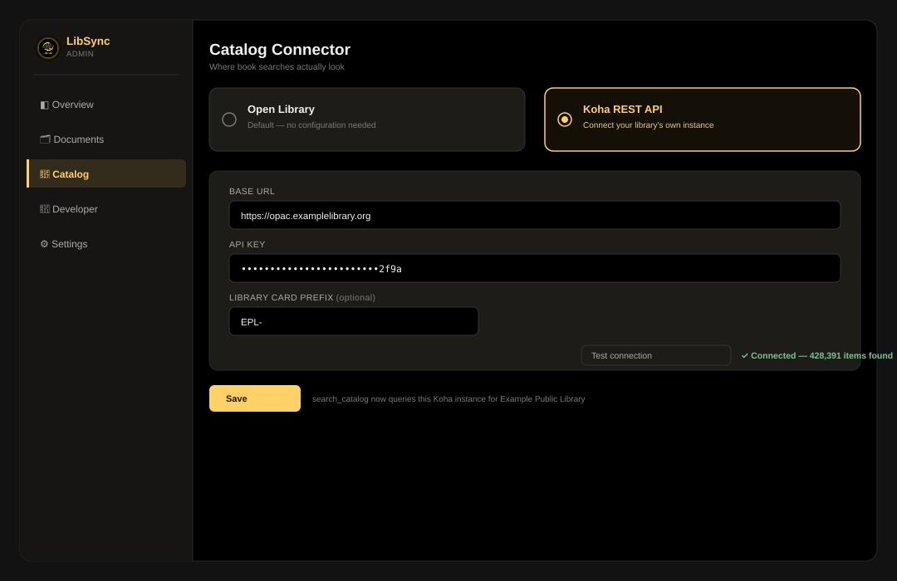
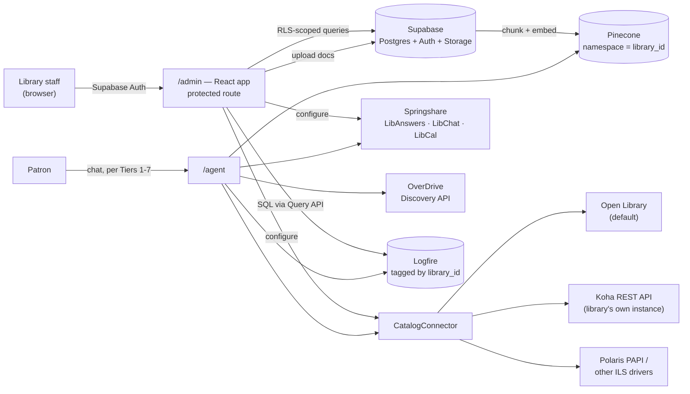

# LibSync — Tier 8: Developer, Manager & Statistics Dashboard

Builds on [TIER1_PLAN.md](TIER1_PLAN.md) (Pinecone integrated-embedding index, Logfire instrumentation),
[TIER4_PLAN.md](TIER4_PLAN.md) (React component library, protected-route capable), and
[TIER6_PLAN.md](TIER6_PLAN.md) (the `data-library` id concept, which becomes a real tenant identifier here).

**The use case:** a library runs its own instance of LibSync and wants to connect it to its own catalog/records,
upload its own policy documents, see usage statistics, and manage all of that through a dashboard — without
touching code. That requires **real multi-tenancy**, which this series has deliberately avoided until now
because nothing before this needed accounts. This tier introduces them for **library staff**, not patrons —
patrons still never need an account; only the people managing an instance do.

---

## 0. Integrating with what libraries already run (research, October 2026)

A library will only adopt LibSync if it plugs into the systems and obligations it already has. This section
was added after researching the current landscape, and it reshaped §2 and the roadmap below. Supabase is
LibSync's own infrastructure, invisible to libraries. Everything a library *touches* should be a system it
already runs.

| Area | What libraries run today | How other vendors integrate | What changes for LibSync |
|---|---|---|---|
| **ILS (catalog + circulation)** | Public libraries: Symphony, Polaris, Sierra (Clarivate is actively selling Polaris), plus Koha and Evergreen; academic: Alma, FOLIO | **One driver per ILS API.** Aspen Discovery, the widely used open-source discovery layer, integrates with Koha, Evergreen, Polaris, Sierra, Symphony, CARL.X and Evolve through each one's own API | `CatalogConnector` becomes a driver model (§2.4): Koha first, then Polaris |
| **Generic catalog search** | Z39.50/SRU servers | Koha and Alma document Z39.50/SRU server support; Sierra and Polaris don't say so publicly | An SRU driver as a best-effort fallback, not the primary path |
| **Patron authentication** | Library card + PIN in the ILS | **SIP2** is how e-resource vendors, proxies and kiosks check a card against any ILS. Privacy proxies like OPLIN's Mask sit between vendors and the ILS so vendors get only what they need | Tier 9 authenticates with SIP2 or the ILS's patron API, never storing PINs |
| **Reference chat, FAQs, room booking** | Springshare: LibAnswers + LibChat, LibCal, LibGuides | OAuth client-credential APIs (Admin → API in each product). Springshare's own chatbot is deliberately **rule-based, not AI** | LibSync complements it rather than replacing it: LibAnswers FAQs as a policy source, LibChat as the human handoff, LibCal for real room/event availability (§2.7) |
| **E-content** | OverDrive/Libby, hoopla, Kanopy, cloudLibrary | OverDrive's Discovery APIs (search, metadata, **availability**) for approved developer partners, per library collection | "Is it on Libby?" can become a real per-library lookup instead of a disclaimer (§2.7) |
| **Staff sign-in** | Microsoft 365 / Google Workspace | Single sign-on | Microsoft + Google sign-in (free in Supabase); SAML on Supabase Pro, $25/month, only if a large system requires it (§2.2) |
| **Accessibility** | Public libraries are state/local government | ADA Title II rule: **WCAG 2.1 AA**. After DOJ's April 2026 interim final rule, compliance is due **April 26, 2027** (populations 50,000+) and **April 26, 2028** (smaller) | An accessibility audit and a published conformance report (VPAT/ACR) before any pilot (§2.8) |
| **Privacy and AI** | 48 states + DC protect library records by law. ALA's vendor privacy guidelines and its **June 2026 Guidance on the Use of AI in Libraries** set the procurement bar | Disclose AI use, no training on patron data, defined retention and deletion, a clear path to a human, the library can disable AI features, libraries keep data control and exit rights | A trust-and-compliance phase that comes **before** a real library pilot (§2.8) |

**Sources:**
- Library Technology Guides, [Library Systems Report 2026](https://librarytechnology.org/LibrarySystemsReport/2026) and [Library Perceptions 2026](https://librarytechnology.org/perceptions/2025/); American Libraries, [2026 Library Systems Briefing](https://americanlibrariesmagazine.org/2026/06/01/2026-library-systems-briefing/)
- Aspen Discovery, [ILS Integration](https://help.aspendiscovery.org/ilsintegration); Ex Libris, [Alma Z39.50 Search](https://knowledge.exlibrisgroup.com/Alma/Product_Documentation/010Alma_Online_Help_(English)/090Integrations_with_External_Systems/030Resource_Management/180Z39.50_Search); Innovative, [Polaris API overview](https://documentation.iii.com/polaris/PAPI/7.1/PAPIService/PAPIServiceOverview.htm)
- OPLIN, [Database Authentication (Mask)](https://www.oplin.ohio.gov/services/authentication); NHAIS, [SIP2 security](https://nhais.blogspot.com/2025/03/sip2-security.html)
- Springshare, [LibAnswers Chatbot announcement](https://librarytechnology.org/pr/28515/springshare-announces-libanswers-chatbot) and [LibCal](https://www.springshare.com/libcal); [APIs for Librarians: LibCal room availability](https://www.apis4librarians.com/libcal/room-availability)
- OverDrive, [API overview](https://developer.overdrive.com/getting-started/api-overview)
- ADA.gov, [Title II web rule](https://www.ada.gov/resources/2024-03-08-web-rule/)
- ALA, [Guidance on the Use of AI in Libraries (June 2026)](https://www.ala.org/tools/standards-and-guidelines/guidance-use-artificial-intelligence-libraries), [Library Privacy Guidelines for Vendors](https://www.ala.org/advocacy/privacy/guidelines/vendors), [State Privacy Laws Regarding Library Records](https://www.ala.org/advocacy/privacy/statelaws)
- Supabase, [SAML 2.0 SSO](https://supabase.com/docs/guides/auth/enterprise-sso/auth-sso-saml); Groq, [Your Data in GroqCloud](https://console.groq.com/docs/your-data)

---

## 1. What changes structurally, and why it's fine to change now

Every prior tier avoided a database and accounts on purpose — Tier 1 explicitly chose an in-memory session
dict *because* Render's free tier has no durable disk and adding a database wasn't justified by what existed
then. A dashboard that persists tenant configuration, uploaded documents, and staff logins is a genuine,
irreducible requirement for a database — not scope creep, an actual different problem. This tier adds the
smallest thing that satisfies it, not a general-purpose backend platform.

---

## 2. Key decisions

### 2.1 Multi-tenancy → one Pinecone namespace per library

**Why:** this is Pinecone's own documented recommendation for multi-tenant RAG (physical data isolation,
independent scaling per tenant, and clean offboarding — delete a namespace, the tenant's data is gone). It's
also already the *shape* of the existing code: `pinecone-scripts/upsert_pinecone_records.py` already has a
`NAMESPACE = "ns1"` constant — Tier 1 already namespaced the data, just to a single hardcoded value.
**How:** replace the hardcoded `"ns1"` with the library's tenant id everywhere Pinecone is touched (the
`search_library_policies` tool, the IaC upsert scripts). No new Pinecone concept — parameterizing an existing one.

### 2.2 Tenant config, staff auth, and document storage → Supabase (free tier)

**Why:** one service instead of three. Supabase's free tier bundles Postgres (tenant config, with Row-Level
Security scoping every query to the logged-in staff member's own library — the standard, documented pattern
for multi-tenant Postgres), Auth (staff login), and Storage (uploaded policy documents before they're chunked
into Pinecone) — versus separately wiring a database, an auth provider, and a file store.
**Staff sign-in:** "Sign in with Microsoft" and "Sign in with Google" (both free Supabase Auth providers), since
library staff already have Microsoft 365 or Google Workspace accounts, plus invite-only email as a fallback.
Public sign-up stays off. SAML SSO is a Supabase Pro feature ($25/month); treat it as a cost to plan for only if
a large system requires it.
**How:** one `libraries` table (id, name, branding, catalog connector config), RLS policies keyed on
`auth.uid()` → staff-to-library mapping, Storage bucket for raw document uploads.
**Budget note (watch item, same pattern as Pinecone/Render elsewhere in this series):** free Supabase projects
pause after 1 week of inactivity (same failure mode as Pinecone Starter and Render's free web service — fold
into the existing weekly keep-alive GitHub Action from Tier 1 Phase 4) and the free tier caps at 500MB
database storage, which is generous for tenant config but worth watching as staff-account count and document
metadata grow across many libraries.

### 2.3 Statistics → query Logfire, don't build a parallel analytics pipeline

**Why:** Tier 1 Phase 4 already instruments every tool call, model request, and error through Logfire.
Building a second event-logging system to power a stats dashboard would duplicate data that already exists.
Logfire ships a real Query API (`LogfireQueryClient`, arbitrary SQL against logged spans, JSON/CSV/Arrow
export) built for exactly this.
**How:** tag spans with the library id at the point tools already run (one attribute addition, not a new
system), then build dashboard charts as SQL queries against Logfire via its Query API: conversation volume,
tool-usage breakdown (policy vs. catalog vs. research vs. citation), error/unanswered rate, and — tying back
to this entire series' budget obsession — usage against the shared free-tier ceilings (Groq requests/day,
Pinecone read/write units, Render bandwidth) surfaced directly in the dashboard instead of living only in
planning docs.

### 2.4 Catalog integration → a pluggable connector, Koha first

**Why:** "hook up their own library records" means real ILS integration, not just Open Library. Of the real
options — Koha, Evergreen (both open-source), SirsiDynix, Ex Libris Alma, Polaris, III Sierra (commercial) —
**Koha** is the right first target: open-source, a documented REST API (Mojolicious + Swagger2, OAuth2/basic
auth, patron and item endpoints), and widely deployed at public libraries, so it's realistic for a demo
library to actually have one to test against.
**How:** a `CatalogConnector` interface with one method shape (`search`, `availability`), with one driver per
ILS API. This is the model Aspen Discovery already uses in production across Koha, Evergreen, Polaris, Sierra and
Symphony (§0). Drivers, in order:
1. `OpenLibraryConnector`: today's default (Tier 1).
2. `KohaConnector`: open source, documented REST API, and testable locally with the community's
   `koha-testing-docker`.
3. `PolarisConnector`: Polaris has a large and growing public-library base, and Innovative's Polaris Developer
   Network offers free sandbox accounts. A library needs a Polaris API Service license for production.
4. `SRUConnector`: a best-effort generic driver for any ILS exposing SRU (documented for Koha and Alma).
5. Sierra and Symphony drivers when a pilot library runs them.

Staff choose the driver and enter its credentials in the dashboard; `search_catalog` uses each library's
configured driver instead of always calling Open Library.
**Noted, not built:** SIP2 and NCIP are the real standard protocols for live circulation data (checked-out
items, holds, fines) — SIP2 is the de facto self-service-terminal standard, NCIP is its NISO-standardized
successor for broader interlibrary transactions. Both are real and worth knowing about, but they're
patron-authenticated, session-oriented protocols aimed at circulation, not catalog search — a materially
deeper integration than a REST connector. Flagged as future/stretch, not Tier 8 scope.

### 2.5 Developer surface → API keys + the API you already have

**Why:** "developer" access mostly means two things: a credential, and documentation. FastAPI already
generates interactive API docs (`/docs`) for free — nothing new to build there.
**How:** extend Tier 6's `data-library` allowlist concept into a real per-library API key (issued from the
dashboard, revocable), and link the existing `/docs` Swagger UI from the dashboard instead of building a
parallel reference. Optional: a webhook URL a library can configure to be notified when a patron thumbs-downs
a reply (Tier 3's feedback action) — a real, low-effort escalation path to a human librarian.

### 2.6 Dashboard UI → a protected route in the existing app, not a new app

**Why:** consistent with every prior tier's "one component library, no duplicated UI work" principle.
**How:** `/admin` route in the Tier 4 React app, gated by Supabase Auth, reusing Tier 3's design tokens.
Introduces client-side routing (React Router or TanStack Router) — the first tier that actually needs it,
since everything before was a single view.

### 2.7 Work alongside Springshare and e-content vendors, not around them

**Why:** many libraries already run Springshare for reference (LibAnswers + LibChat), room booking (LibCal) and
research guides (LibGuides). Springshare's own chatbot is deliberately rule-based, and its marketing pitches
"Librarian Intelligence" against AI. That leaves room for LibSync as the AI layer, but only if it respects the
human-staffed workflow libraries already run.
**How**, each optional per library and configured in the dashboard with Springshare's OAuth client credentials:
- **LibAnswers FAQs as a policy source:** sync a library's existing FAQ entries into its Pinecone namespace, so
  it doesn't have to re-upload documents it already maintains.
- **LibChat as the human handoff:** when the agent can't answer, or the patron asks for a person, offer the
  library's own LibChat. This is also the "clear path to human assistance" ALA's AI guidance requires (§2.8).
- **LibCal availability:** a tool that answers "is a study room free at 3?" with real data instead of a policy
  summary. Read-only at first; booking stays a link to LibCal.
- **E-content availability:** an OverDrive Discovery API tool (search + availability against the library's own
  collection) replaces the "I can't check Libby" disclaimer for libraries that configure it. Requires becoming
  an approved OverDrive developer partner. hoopla, Kanopy and cloudLibrary come later and only on request.

### 2.8 Trust and compliance come before a real pilot

**Why:** a library can't adopt an AI service that fails its accessibility law or its privacy law and ALA
guidance, however good the answers are. These are procurement gates, not polish.
**How:**
- **Disclose AI use** in the widget and app ("You're chatting with an AI assistant"), with a link to a plain-language
  page on what's collected, how long it's kept, and which providers process it.
- **Data handling:** turn on Groq's Zero Data Retention (available on every Groq plan; without it, Groq may keep
  request logs up to 30 days for abuse and reliability monitoring, though its terms forbid training on them).
  Review whether the Hugging Face fallback's provider retention is acceptable, or drop it. Keep no chat
  transcripts server-side beyond the session TTL, and never put patron identifiers in traces.
- **Library control:** a per-library switch to disable the AI assistant entirely, and per-tool switches
  (e.g. turn off research or catalog lookups).
- **A human path, always:** a visible "talk to a librarian" option (LibChat, email or phone, from the library's
  config) on every conversation.
- **Accessibility:** a WCAG 2.1 AA audit of the patron widget, the standalone app and the dashboard, with a
  published accessibility conformance report (VPAT/ACR). The deadlines are April 2027 or 2028, depending on the
  library's population.
- **Contract readiness:** a data processing agreement template that follows ALA's vendor privacy guidelines:
  the library owns its data, deletion on request, an exit path, and no training on patron data.
- **Ongoing accuracy:** the live eval suite (`server/evals/`) is the "regular audits of AI tools" ALA asks for.
  Extend it with each library's own policies once they're uploaded.

---

## 3. What it looks like

Mockups, not screenshots — nothing here is built yet — but concrete enough to build from, in the same brand
as the patron-facing app with a dashboard's own chrome (no floating-widget glow; this is a workspace).

**Overview** — the statistics dashboard from §2.3: conversation volume, tool-call breakdown, and — the
throughline of this entire series — free-tier headroom for Groq, Pinecone, and Render surfaced directly where
staff will actually see it, not buried in a planning doc.

**Documents** — the upload/management UI from Phase 31: drag-and-drop, and a status per document (embedded,
processing, or error) so a librarian can tell at a glance whether something actually made it into their
namespace.

**Catalog connector** — the actual "hookup," from §2.4: choosing Koha over the Open Library default, entering
the library's own base URL and API key, and a live test-connection result before saving.

---

## 4. Architecture

---

## 5. Roadmap (continues Tier 1–7's phase numbering)

| Phase | Scope | Est. |
|---|---|---|
| **30** | Supabase project: `libraries` table + RLS, staff auth (Microsoft + Google sign-in, invite-only email). *Already done (PR #49): per-library Pinecone namespaces that activate automatically, and `library_id` on every trace* | 4–6 days |
| **31** | Document management UI: upload → Storage → chunk/embed into the library's namespace, replacing the manual `pinecone-scripts` workflow. Plus an optional LibAnswers FAQ sync as a second source | 5–7 days |
| **32** | `CatalogConnector` driver model: `KohaConnector` (tested against `koha-testing-docker`), then `PolarisConnector` (Polaris Developer Network sandbox), then a best-effort `SRUConnector`; per-library driver config UI | 7–10 days |
| **33** | Statistics dashboard: usage, error and budget-headroom views over the `library_id`-tagged Logfire traces | 3–5 days |
| **34** | Developer surface: per-library API key issuance, link `/docs`, optional escalation webhook | 2–3 days |
| **35** *(stretch)* | SIP2/NCIP live-circulation connector; also the shared plumbing for Tier 9's card-and-PIN sign-in | — |
| **36T** | Trust and compliance (§2.8): AI disclosure, Groq Zero Data Retention, per-library disable switches, the "talk to a librarian" path, WCAG 2.1 AA audit + VPAT/ACR, a data processing agreement template. **Required before any real library pilot** | 5–8 days |
| **37T** | Springshare + e-content integrations (§2.7): LibChat handoff, LibCal availability tool, OverDrive availability tool | 5–8 days |

**Recommended order:** 30 → 36T → 31 → 32 → 33 → 37T → 34. Trust and compliance moves up because it gates a
pilot, while the stats and developer surfaces matter only once a library is live. The **T** suffix keeps
Tier 9's existing Phase 36–39 numbers unchanged.

**Done when:** a second (test) library can be fully onboarded through the dashboard — its own namespace, its
own uploaded documents, its own catalog connector, its own stats view — with zero code changes and zero
visibility into the first library's data.

---

## 6. Budget ledger addendum

| Item | Free-tier ceiling | Risk |
|---|---|---|
| Supabase (Postgres + Auth + Storage) | 500MB DB, 50k MAU auth, 1GB file storage, pauses after 1wk idle | Medium — same keep-alive pattern as Pinecone/Render; watch DB size as tenants grow |
| Pinecone namespaces | up to 100k namespaces before Support contact needed (Standard/Enterprise) | Low at pilot scale |
| Logfire Query API | same free Hobby quota as Tier 1's tracing | Low |
| Koha connector | $0 — calls the library's own existing Koha instance, no new service on LibSync's side | Low |
| Polaris / other ILS drivers | $0 to LibSync — the free Polaris Developer Network sandbox covers development; the *library* licenses its own Polaris API Service | Low |
| Springshare / OverDrive integrations | $0 to LibSync — each uses the library's own subscription and API credentials; OverDrive requires approval as a developer partner | Low |
| SAML SSO (optional) | Supabase Pro, $25/month — only if a large system requires SAML; Microsoft/Google sign-in is free | Planned exception, not default |
| Accessibility audit / VPAT | $0 if self-audited against WCAG 2.1 AA with free tooling; a third-party audit is a real cost a pilot library may ask for | Medium |

**Honest framing, consistent with this series' existing "watch items" (Pinecone Starter pausing, Render
bandwidth):** this tier is genuinely $0 for a pilot — one library, modest usage. Unlike Tier 7's app-store
fees (a hard, unavoidable cost), Supabase's ceilings are the same kind of "free tier that needs occasional
attention" as several services already in this stack, not a new category of cost.

---

## 7. Definition of done

- Library staff log in and see only their own library's data — enforced by RLS, not just UI hiding.
- A librarian can upload a policy document and have it searchable in chat within their own Pinecone namespace, with no code changes.
- A librarian can point catalog search at their real Koha instance instead of Open Library.
- A stats view shows real usage — conversation volume, tool breakdown, error rate, and free-tier budget headroom — sourced from Logfire, not a second logging system.
- Patron-facing behavior across Tiers 1–7 is completely unaffected — this tier is additive, staff-only.
- Staff sign in with their existing Microsoft or Google work account.
- A library can meet its procurement checks: AI use disclosed to patrons, a documented retention and deletion
  policy, AI that can be switched off, a human path on every conversation, and a published WCAG 2.1 AA
  conformance report.

From here, [TIER9_PLAN.md](TIER9_PLAN.md) covers the patron side: real accounts, optional and additive, built
on the `CatalogConnector` and Supabase Auth this tier introduces — "sign in with your library card" is only
possible because a library's ILS is now a first-class concept in the system.
