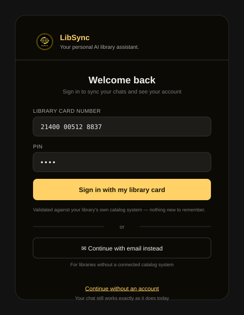

# LibSync — Tier 9: Patron Accounts

Builds on [TIER5_PLAN.md](TIER5_PLAN.md) (client-side chat history, explicitly flagged there as "would need
accounts to sync across devices") and [TIER8_PLAN.md](TIER8_PLAN.md) (Supabase Auth infrastructure and the
`CatalogConnector` abstraction — Koha's REST API exposes patron endpoints, which is what makes "sign in with
your real library card" buildable instead of inventing a parallel account system).

**Why this is Tier 9 and not slotted earlier:** real patron authentication — the version worth building, not a
token gesture — depends on Tier 8's catalog connector existing. A library card number + PIN needs an ILS to
validate against. That dependency is real, not a scheduling convenience, which is why this couldn't have been
Tier 6 or folded into Tier 5.

---

## 1. The oversight, named plainly

Every tier through 8 kept patrons anonymous by design — a defensible default for a chat widget, less
defensible once Tier 5 gave patrons real, named conversations they might reasonably expect to have again
tomorrow, on their phone, signed in as themselves. Tier 5 flagged this and deferred it; this tier is that
deferral resolved, not a reversal of the earlier choice. **Anonymous stays the default.** Nothing here gates
existing functionality behind a login — it's additive.

---

## 2. Key decisions

### 2.1 Dual-mode authentication, not a single new login system

**Why:** not every library will have a Tier 8 catalog connector configured — some stay on the Open Library
default. Patron accounts shouldn't be entirely gated behind a library's ILS integration status.
**How:**
- **Primary — "Sign in with your library card":** card number + PIN, validated against the library's own ILS.
  No new credential to remember — this *is* their existing library card. Revised after the October 2026
  research ([TIER8_PLAN.md §0](TIER8_PLAN.md#0-integrating-with-what-libraries-already-run-research-october-2026)):
  **SIP2** is how e-resource vendors, proxies and kiosks already authenticate patrons against *any* ILS, so it
  is the default path. The ILS's own patron API (Koha REST, Polaris PAPI) is used where the library prefers it.
  SIP2 replies include the patron's personal details whether or not the caller needs them, so the connection
  must be encrypted (TLS or a VPN tunnel), and LibSync keeps only the card's validity and a library-scoped
  patron reference. It never stores the PIN or the personal details, following the privacy-proxy model of
  services like OPLIN's Mask.
- **Fallback — lightweight account:** email + magic link via the same Supabase Auth instance Tier 8 already
  runs, for libraries without a connected ILS. Same account model, weaker guarantee (not tied to a real patron
  record), still real enough to sync history.

### 2.2 What an account actually unlocks

Not accounts for their own sake — three concrete things:
- **Cross-device chat history sync.** Tier 5's IndexedDB store stays the mechanism for anonymous patrons; a
  signed-in patron's history additionally syncs through Supabase, so it survives a new device or browser.
- **Saved preferences** — default citation style (APA/MLA/Chicago), remembered instead of re-asked every time.
- **Real patron status, ILS-backed accounts only:** a new `patron_status` tool — "what do I have checked out,"
  "when is this due," "do I have holds ready" — genuinely real data, gated to only fire when signed in through
  the ILS path, not the email-fallback path (there's no real patron record to check for those).

### 2.3 Privacy is not an afterthought here — it's already in the persona

The system prompt has carried the ALA Library Bill of Rights and Core Values since Tier 1, distilled into
`bot_context/service_principles.py` since October 2026 — patron confidentiality is a named professional value in
there already, not something this tier introduces. Tier 8's trust-and-compliance phase (36T: Groq Zero Data
Retention, AI disclosure, documented retention) is a prerequisite here, since accounts mean storing patron
data for the first time. That makes the bar concrete, not aspirational: clear, discoverable
controls to view and delete stored history, no cross-library data sharing (RLS from Tier 8 already enforces
tenant isolation; this extends the same guarantee to patron rows), and minimal retention by default.

### 2.4 Reuse Tier 8's Supabase project, don't spin up a second one

**Why:** Supabase's free tier caps at 2 active projects — patron accounts living in a second project would
burn that headroom for no reason, and would mean maintaining two RLS policy sets instead of one.
**How:** a `patrons` table alongside Tier 8's `libraries` table, RLS scoped to `auth.uid()` the same way, in
the same project.

---

## 3. What it looks like

A patron opens the sidebar (Tier 5), sees "Sign in with your library card" alongside "Continue without an
account" — signing in is a choice offered, not a wall blocking the chat.

---

## 4. Roadmap (continues Tier 1–8's phase numbering — Phase 35 stays reserved for Tier 8's unscoped SIP2/NCIP stretch, so this starts at 36)

| Phase | Scope | Est. |
|---|---|---|
| **36** | Dual-mode auth: Supabase magic-link fallback + ILS card-number/PIN auth via SIP2 (default) or the ILS patron API (Koha REST, Polaris PAPI), built on Tier 8 Phase 35's SIP2 plumbing | 5–8 days |
| **37** | Synced chat history: Tier 5's IndexedDB store gains a Supabase-backed sync layer for signed-in patrons; stays local-only for anonymous ones | 3–5 days |
| **38** | `patron_status` tool — real checkouts/holds/due dates, ILS-backed accounts only | 3–4 days |
| **39** | Privacy controls: view/delete stored history, retention policy surfaced in-app, tied to the ALA privacy values already in the persona | 2–3 days |

**Done when:** an anonymous patron's experience is unchanged from Tier 7 — no wall, no nag. A signed-in patron
gets history that survives a device switch. An ILS-authenticated patron can ask "what do I have checked out"
and get a real answer. A visible control exists to delete everything.

---

## 5. Budget ledger addendum

| Item | Cost |
|---|---|
| Supabase Auth (same project as Tier 8) | $0 — 50k MAU free-tier ceiling, enormous headroom over a single-library patron base |
| ILS-backed auth | $0 — calls the library's own existing ILS over SIP2 or its patron API; the library provisions the SIP2 account |
| No second Supabase project | Avoids burning the 2-project free-tier cap for no reason |

---

## 6. Definition of done

- Anonymous use is unchanged — signing in is offered, never required.
- A patron can sign in with their real library card where an ILS connector exists, or a lightweight email
  account where it doesn't.
- Chat history syncs across devices for signed-in patrons.
- ILS-authenticated patrons can query their real checkout/hold status.
- A discoverable control exists to view and delete a patron's own stored history.
