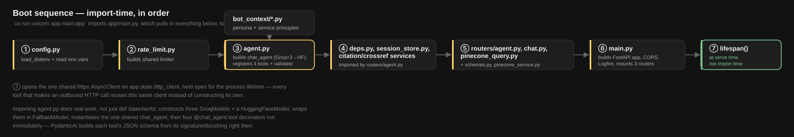
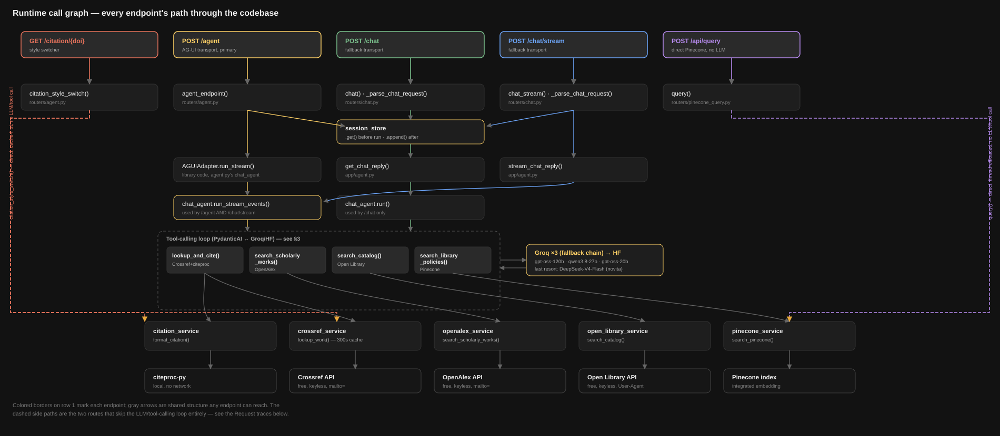

# LibSync Server — Execution Trace

Two diagrams: what runs at import time, and the call chain from each HTTP endpoint down through routers,
the agent, its tools, the backing services, and the external systems they call. See
[ARCHITECTURE.md](../ARCHITECTURE.md) for the *why* — this doc is just *what calls what*.

## Boot sequence

  

## Runtime call graph

  

The two dashed side paths (`citation_style_switch()` and `query()`) are the only routes that skip the
LLM/tool-calling loop entirely — everything else funnels through the one shared `chat_agent`.

---

## Symbol index

The diagrams show every file and every *entry point*; they don't have room for every private helper. This
is the rest, one line per symbol, grouped by file.

**`app/main.py`** — `lifespan(app)` opens/closes the shared `httpx.AsyncClient`; `rate_limit_handler(request, exc)` returns 429 JSON.

**`app/config.py`** — no functions, just `load_dotenv` + env var reads at import time.

**`app/session_store.py`** — `SessionStore.get/append/_evict_expired/_evict_oldest_if_full`; one shared `session_store` instance, same class for both transports (only the key differs: client-minted `session_id` vs. AG-UI `thread_id`).

**`app/schemas.py`** — `Book`, `BookResult`, `ScholarlyWork`, `ResearchResult`, `Citation`, `QueryRequest`; every model here is referenced by a route (the five that weren't — `ChatRequest`, `ChatResponse`, `ErrorResponse`, `QueryMatch`, `QueryResponse` — were removed).

**`app/agent.py`** (beyond what's in the diagram) — `_custom_event(name, value) -> CustomEvent`, the helper every tool uses to attach a card payload to `ToolReturn.metadata`; `_reject_leaked_tool_call_syntax(data)`, the output validator that retries a turn if the model leaks raw tool-call syntax into text.

**`app/routers/agent.py`** — `_persist(result)`, the closure that saves both the frontend's new turn *and* `result.new_messages()` to `session_store` (both are needed — `new_messages()` alone silently drops the user's own message every turn, a real bug fixed during Tier 2).

**`app/routers/chat.py`** — `_parse_chat_request(request)` manually parses the JSON body and mints a `session_id` if none was sent; `_format_sse(event, data)` formats the old `event: .../data: ...` frame; `_has_json_body(request)`.

**`app/services/pinecone_service.py`** — `_get_index()` lazily constructs the `Pinecone` client on first call — deliberately, not just deferred-for-convenience: `PINECONE_API_KEY` has no safe placeholder default the way `GROQ_API_KEY`/`HUGGINGFACE_TOKEN` do, and `Pinecone(api_key=None)` raises immediately, so building it eagerly at import time would break importing `app.main` (and every test) in any environment without a real Pinecone key.

**`app/services/open_library_service.py`** — `_availability_from_search_doc(doc)`, `_check_availability(client, edition_olid)` (returns `"unknown"` on any failure rather than propagating).

**`app/services/openalex_service.py`** — `_reconstruct_abstract(inverted_index)` rebuilds plain text from OpenAlex's word→position index.

**`app/services/citation_service.py`** — `crossref_to_csl_json(work)` maps Crossref → CSL-JSON, **omitting** absent optional fields rather than setting `None` (citeproc-py renders a `None` field literally, e.g. `"(None)"`).

---

## Worth knowing

Three things this trace surfaced, now resolved:

- **5 dead schemas** in `schemas.py` were never referenced by any route — removed (`ChatRequest`,
  `ChatResponse`, `ErrorResponse`, `QueryMatch`, `QueryResponse`).
- **`POST /api/query` blocked the event loop** during its Pinecone call while the equivalent tool
  (`search_library_policies`) offloaded the same call to a thread — `query()` now does the same via
  `anyio.to_thread.run_sync`, matching the tool's pattern.
- **`_pinecone_client`'s lazy construction turned out to be load-bearing, not an inconsistency to fix.**
  `Pinecone(api_key=None)` raises immediately, and `PINECONE_API_KEY` (unlike `GROQ_API_KEY`/
  `HUGGINGFACE_TOKEN`) has no `"unset"`-style placeholder fallback — verified live: `Pinecone(api_key=None)`
  does in fact raise `PineconeValueError` on construction. Making this eager would break importing
  `app.main` in any environment without a real Pinecone key, so it stays lazy; the reasoning is now a
  comment on `_get_index()` instead of an unexplained inconsistency.
